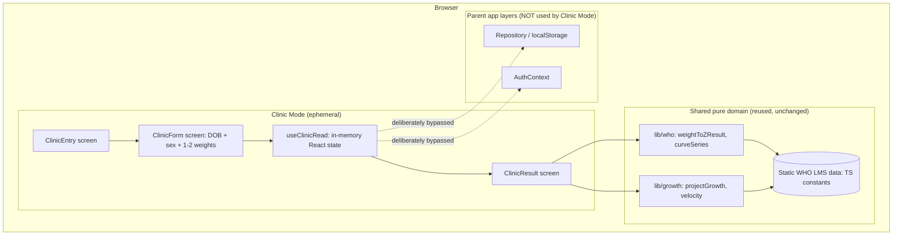

# HLD: Clinic Mode

> **Version:** 1.0
> **Date:** 2026-06-17
> **PRD reference:** docs/PRD-clinic-mode.md
> **Parent HLD:** docs/HLD.md
> **Status:** Draft

---

## 1. Tech Stack

Clinic Mode is a feature **inside the existing growUp web app**, so it inherits the project stack unchanged. No new layers, services, or dependencies are introduced — the whole point of the feature is that the WHO engine already exists and is framework-free.

| Layer | Technology | Version | Why (for Clinic Mode) |
|---|---|---|---|
| Frontend | React + Vite + TypeScript (SPA) | React 19, Vite 6 | Reuses the app shell, routing, and component primitives. |
| Styling | Tailwind CSS (logical properties) | Tailwind 4 | Same utility system; logical props keep the future Hebrew/RTL switch free. |
| Routing | React Router | 7 | New top-level routes, lazy-loaded like the existing screens. |
| Charts | Recharts | 2.x | Reuses the existing WHO curve chart with 1–2 entered points. |
| Domain logic | Pure TS WHO module (`src/lib/who`, `src/lib/growth`) | — | `weightToZResult`, `curveSeries`, `projectGrowth` are already pure and reusable — zero medical-math re-implementation. |
| Forms / validation | react-hook-form + Zod | RHF 7, Zod 3 | Same pattern as `ChildForm`/weight entry; new Zod schema for the clinic input form. |
| State | **In-memory React state only** | — | Clinic Mode is fully ephemeral by PRD decision — it deliberately does **not** use the repository, localStorage, or AuthContext. |
| Unit tests | Vitest + React Testing Library | Vitest 2 | New tests cover the clinic-input schema and single-vs-two-weight result logic; WHO math is already covered. |
| Backend / DB / API / Auth | **None** | — | No account, nothing stored, no network calls. Same as the parent MVP. |

**Monthly cost impact:** **$0** — no new infrastructure.

**The one hard rule that defines this feature technically:** Clinic Mode must never touch persistence or identity. It does not import the repository, does not read/write `localStorage`, and does not consume `AuthContext`. All state lives in component state and is gone on unmount/refresh.

---

## 2. System Architecture

Clinic Mode is a self-contained branch of the SPA that reaches *down* into the shared pure-domain layer but **bypasses the data and auth layers entirely**.



**Key architectural decisions:**
- **Reuse the pure domain, re-implement nothing.** `weightToZResult(weightGrams, sex, ageDays)`, `curveSeries(...)`, and `projectGrowth(...)` already encapsulate every WHO calculation. Clinic Mode is a thin UI over these. No medical math is copied or forked.
- **Ephemeral by construction.** A single `useClinicRead` hook holds the form values and derived results in React state. There is no repository call and no `useEffect` writing anything out. Closing/refreshing the route clears everything because it only ever lived in memory.
- **Routed outside the guarded layout.** The parent app's `PrimaryLayout` redirects to `/onboarding` when no child exists and renders the bottom tabs. Clinic Mode routes live **outside** that layout: no child guard, no bottom tabs, no profile dependency.
- **Lazy-loaded like every other screen.** The clinic screens (which pull Recharts) load via `React.lazy` so they add nothing to the initial bundle for parent users.
- **Age computed locally from DOB.** The form captures DOB + measurement date(s); age-in-days per measurement is derived with the existing date utilities and passed to `weightToZResult`/`projectGrowth`.

---

## 3. Data Model

Clinic Mode has **no persisted entities**. It defines transient in-memory shapes only.

### Storage strategy per data type

| Data | Storage type | Rationale |
|---|---|---|
| Clinic input (DOB, sex, 1–2 weights + dates) | **In-memory React state** (`useClinicRead`) | Ephemeral by PRD decision — nothing is saved anywhere. |
| Computed read (percentile, z-score, trend, velocity, catch-up) | **Derived in-memory** (computed from inputs via pure domain fns) | Recomputed on input change; never stored. |
| WHO weight-for-age LMS tables | **Static TS constant** (`src/data/who/`) | Already exists, read-only, shared. |

### Transient types (new)

```ts
// src/features/clinic/types.ts
interface ClinicWeightEntry {
  weightGrams: number;
  measuredOn: string; // ISO date (local), defaults to today
}

interface ClinicInput {
  dateOfBirth: string;      // ISO date
  sex: Sex;                 // reuse existing 'male' | 'female'
  birthWeightGrams: number; // REQUIRED — weight at birth (age 0 days); anchors the read
  currentWeights:           // 1–2 current readings with dates
    | [ClinicWeightEntry]
    | [ClinicWeightEntry, ClinicWeightEntry];
}

interface ClinicRead {
  ageDaysAtLatest: number;
  zResult: ZResult;                 // reuse existing { z, percentile } at the latest weight
  birthZResult: ZResult;            // percentile/z at birth (day 0) — "born at the Xth"
  curve: CurveSeries;               // reuse existing curveSeries output
  // Trend is ALWAYS available: birth weight is a required point, so birth + ≥1
  // current weight is always ≥2 dated points. Computed via the reused velocity fn.
  trend: {
    direction: 'gain' | 'loss' | 'flat';
    gramsPerDay: number;
  };
  catchUp: {                        // catch-up when below target, maintenance otherwise
    mode: 'catch-up' | 'maintenance';
    gramsPerDay: number;
    gramsPerWeek: number;
  };
}
```

> **Implementation note:** `useClinicRead` assembles an ephemeral `WeightEntry[]`
> (synthetic ids, never persisted) = `[{ date: dateOfBirth, grams: birthWeightGrams }, ...currentWeights]`
> and feeds it to the SAME pure functions the parent app uses (`weightToZResult`,
> `curveSeries`, `weightVelocity`/`projectGrowth`). Birth weight is just the first
> entry, so no new medical math is written.

### Business rules (enforced in the schema/domain, not just UI)
- DOB, sex, and **birth weight** are all required; without all three, no `ClinicRead` is produced.
- At least one current weight (with a date, defaulting to today) is required.
- Age at every measurement must fall within the WHO 0–730 day range (existing `lmsForAge` clamps; the form rejects out-of-range with a message rather than silently clamping). Birth weight sits at day 0 by definition.
- Current-weight dates must be on/after the date of birth. With two current weights, the second `measuredOn` must be on/after the first.
- Birth weight + the first current weight always give ≥2 dated points, so `trend` and `catchUp` always compute. A second current weight refines recent velocity but is never required for a trend.

---

## 4. API Surface

**None.** Clinic Mode makes no network requests and exposes no endpoints. All computation is synchronous, in-browser, against static WHO data. This section exists to state the absence explicitly: there is no REST/RPC surface to build, secure, or rate-limit for this feature.

---

## 5. Folder Structure

New code is isolated under a `clinic` feature folder, mirroring the existing `growth`/`feeding`/`profile` convention.

```
src/
  features/
    clinic/                      → NEW
      ClinicEntry.tsx            → entry + "nothing saved / not a diagnosis" notice
      ClinicForm.tsx             → DOB + sex + birth weight + 1–2 current weight rows (RHF + Zod)
      ClinicResult.tsx           → percentile/z-score + chart + trend + catch-up
      useClinicRead.ts           → in-memory state + derives ClinicRead via lib/who & lib/growth
      clinicSchema.ts            → Zod schema for ClinicInput
      types.ts                   → transient types above
      *.test.ts(x)               → schema + result-derivation tests
  app/
    routes.tsx                   → add /clinic routes (edited)
  lib/
    who/                         → REUSED, unchanged
    growth/                      → REUSED, unchanged
  i18n/
    copy/en.ts                   → add clinic copy block (edited)
```

No changes to `data/`, `auth/`, or `lib/supabase/` — Clinic Mode does not depend on them.

---

## 6. Component Tree

### /clinic/result (the only non-trivial screen)

```
ClinicResult ('use client' — it's an SPA, all client)
├── ClinicResultHeader
│   └── PercentileZScoreCallout        → current percentile/z + "born at the Xth" (birthZResult), plain-language sentence
├── WeightChart (REUSED from growth)   → WHO curves + birth point (day 0) + 1–2 current points
├── TrendCard                          → direction + g/day (always present; birth→latest)
├── CatchUpCard                        → catch-up OR maintenance framing (reuses ProjectionCard)
└── ClinicDisclaimerNote               → "supports, not replaces, clinical judgment"
ClinicResult footer
└── NewReadButton                      → resets useClinicRead → back to blank ClinicForm
```

**Shared/reused components:**
- `WeightChart` (or its underlying chart) from `features/growth` — reused to plot curves + points.
- `Button`, form inputs from `components/ui` — reused.

---

## 7. Environment Variables

**None.** Clinic Mode introduces no env vars (no API keys, no service config). It runs entirely on the static client bundle.

---

## 8. Key Technical Risks

| Risk | Likelihood | Impact | Mitigation |
|---|---|---|---|
| Accidental coupling to the repository/auth layer (a dev imports `useRepository`/`AuthContext` out of habit), breaking the "nothing stored" guarantee | Med | High | Lint/review rule: nothing under `features/clinic/**` may import from `data/`, `auth/`, or `lib/supabase/`. Add a unit/architecture test asserting no such imports. |
| Reused `WeightChart` assumes a full measurement history and renders awkwardly with 1–2 points | Med | Med | Spike the chart with 1 and 2 points first; pass an explicit focus/zoom range; add an `isClinic` rendering variant if needed. |
| Velocity/catch-up math behaves oddly at the edges (same-day weights, baby on/above the line) | Med | Med | Reuse `projectGrowth` (already tested); add clinic-specific tests for same-date guard and the maintenance-vs-catch-up branch. |
| Analytics needed for the <60s success metric conflict with "nothing stored" | High | Med | Decide acceptable anonymous, non-identifying timing analytics (see PRD open question) before wiring; default to none until approved. |
| Clinician reaches Clinic Mode and parent data leaks in (or vice versa) via shared global state | Low | High | Clinic state is local to `useClinicRead`; no shared store. Verify entry/exit clears state and never reads child context. |

---

## 9. Open Technical Questions

**Blocks development — resolve before the relevant milestone:**
- [ ] Anonymous analytics for time-to-insight: which events (if any) may be emitted given the no-storage stance, and via what tool? (mirrors PRD open question) — gates the success-metric instrumentation, not the core feature.

**Decide during development — won't block early work:**
- [ ] Whether `WeightChart` needs a dedicated `clinic` variant or can be configured via existing props for the 1–2 point case.
- [ ] Exact plausibility thresholds for soft weight/age warnings.
- [ ] Default chart zoom for one vs two points (reuse the growth focus ranges?).

---

## Next Steps

1. **No project init needed** — feature lives in the existing repo.
2. **Scaffold** `src/features/clinic/` and add `/clinic` routes (outside `PrimaryLayout`).
3. **Run `/create-ui`** — design tokens reuse + blueprints/shells for ClinicEntry, ClinicForm, ClinicResult.
4. **Run `/plan-for-agents`** — wave-based build plan (reads this HLD + UI outputs).
5. **Run `/tests-for-agents`** — QA agent team plan.

*This HLD is a living document. Update as technical decisions evolve.*
