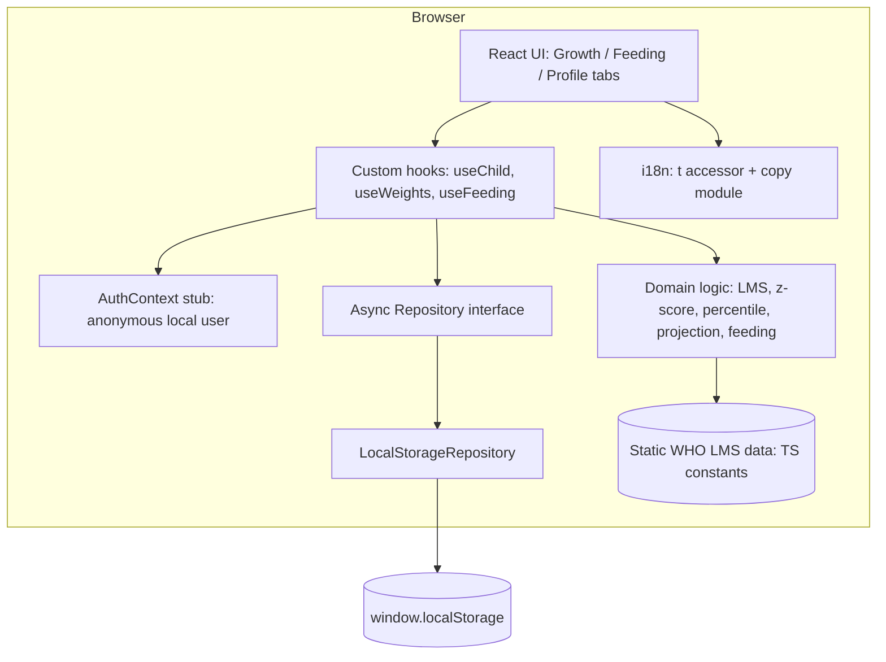
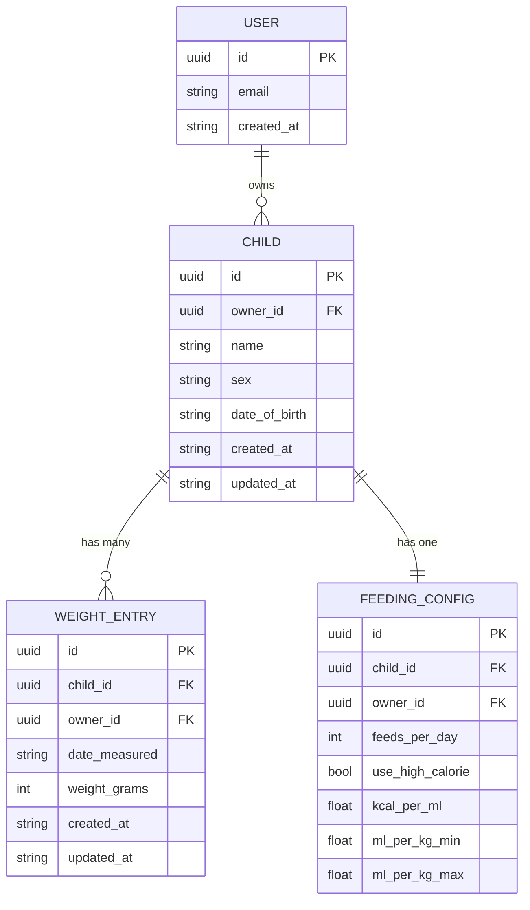

# HLD: GrowUp

> **Version:** 1.0
> **Date:** 2026-06-09
> **PRD reference:** docs/PRD.md
> **Status:** Draft

---

## 1. Tech Stack

Chosen for: **web (mobile-first)** + **$0/mo budget** + **solo build** + **local-only MVP that must grow into a logged-in, server-backed, bilingual (EN→HE) app**.

| Layer | Technology | Version | Why |
|---|---|---|---|
| Frontend | React + Vite + TypeScript (SPA) | React 19, Vite 6 | No server needed for the MVP, so SSR frameworks (Next.js) would add dead weight. Vite gives the fastest DX and a tiny config surface. |
| Styling | Tailwind CSS (with **logical properties**) | Tailwind 4 | Mobile-first utility CSS. Using logical properties (`ps/pe`, `ms/me`, `text-start/end`) instead of physical `left/right` makes the future Hebrew/RTL switch a drop-in. |
| Routing | React Router | 7 | Simple client-side routing for the 3 bottom tabs. |
| Charts | Recharts | 2.x | Highest-adoption React chart lib, cleanest component model; renders the 5 WHO percentile curves + the baby's measured points with minimal code. (visx is the escape hatch if a curve ever needs bespoke D3 control.) |
| Data access | **Async repository interface** → `LocalStorageRepository` | — | All persistence hidden behind an async interface. localStorage is right-sized for the tiny dataset; the async signatures + swap point mean a future API/DB implementation needs no call-site changes. |
| Auth | **`AuthContext` stub** (anonymous local user) | — | No login in MVP, but components read the current user from context now, so adding real auth later swaps the provider rather than rewiring screens. |
| i18n | Central typed copy module + `t()` accessor | — | English-only MVP, but all copy lives in one typed file behind `t()`. Adding Hebrew later = add `he.ts` + flip `dir`. |
| Forms / validation | react-hook-form + Zod | RHF 7, Zod 3 | Zod validates all user input (weights, dates, formula kcal) at runtime; RHF gives clean mobile form UX. |
| Unit tests | Vitest + React Testing Library | Vitest 2 | Vite-native. The LMS/z-score/percentile/projection math is the highest-risk code and must be unit-tested against known WHO reference values. |
| Backend / DB / API / Cloud services | **None (MVP)** | — | Local-only by design: private, free, offline-friendly. Architected for a server in the next phase (§10). |

**Monthly cost at MVP scale:**

| Service | Plan | Cost |
|---|---|---|
| Static hosting (Vercel Hobby — default) | Free | $0 |
| **Total** | | **$0/mo** |

---

## 2. System Architecture

The MVP is a pure client-side SPA. Everything — including the WHO standards data and all growth math — runs in the browser. No network calls.



**Key architectural decisions:**
- **Domain logic is pure and framework-free.** All WHO math (z-score, percentile, inverse-percentile, velocity, projection) lives in plain TypeScript functions with no React/DOM dependencies — so it's trivially unit-testable and reusable on a future server.
- **Persistence is behind an async interface (the seam for the backend phase).** UI and hooks never touch `localStorage` directly; they call `repository.children.list()` etc., which return Promises today even though localStorage is synchronous. Swapping to an HTTP/DB-backed implementation later changes one wiring file.
- **Identity is behind context (the seam for the auth phase).** A stub `AuthContext` supplies an anonymous local user with a stable generated `id`. Entities are stamped with `ownerId` now, so local rows map cleanly to future per-user DB rows.
- **Copy is behind `t()` (the seam for the Hebrew phase).** No literal UI strings in components. Layout uses logical CSS properties so RTL is a configuration flip, not a redesign.
- **WHO standards are a static, read-only TS dataset.** They change only with the app code; embedding them as typed constants is correct (no DB, no fetch) and keeps the app fully offline.

---

## 3. Data Model

The MVP persists data locally as JSON under namespaced localStorage keys, but the **entity shapes are designed to become database tables** in the next phase. Every entity carries a UUID `id`, an `ownerId`, and UTC ISO timestamps.

### Storage strategy per data type

| Data | Storage type | Rationale |
|---|---|---|
| WHO weight-for-age LMS tables | **Static TS constant** (`src/data/who/`) | Read-only, changes only on deploy, small. Never a DB row. |
| Child profile(s) | **localStorage** (via repository) | User-created, edited without deploy. Future: `children` DB table. |
| Weight entries | **localStorage** (via repository) | User-created, CRUD. Future: `weight_entries` DB table. |
| Feeding config | **localStorage** (via repository) | Small per-child settings. Future: `feeding_configs` DB table. |
| App/computed values (age, z, percentile, projection) | **In-memory only** | Always derived from entities + WHO data; never persisted, to avoid stale duplicates. |

### Entities

**Child**
- Purpose: the infant being tracked.
- Future table: `children`
- Key fields:
  - `id` uuid PK
  - `ownerId` uuid — anonymous local user now; real user FK later
  - `name` string
  - `sex` `'male' | 'female'` — required; selects the WHO table
  - `dateOfBirth` string (ISO `YYYY-MM-DD`)
  - `createdAt` / `updatedAt` string (UTC ISO)
- Rules: `dateOfBirth` not in the future; `sex` required.

**WeightEntry**
- Purpose: one weight measurement on a date.
- Future table: `weight_entries`
- Key fields:
  - `id` uuid PK
  - `childId` uuid FK → Child
  - `ownerId` uuid
  - `dateMeasured` string (ISO `YYYY-MM-DD`)
  - `weightGrams` integer — **stored in grams** to avoid floating-point drift; displayed as kg+g
  - `createdAt` / `updatedAt` string (UTC ISO)
- Rules: `dateMeasured` ≥ child's `dateOfBirth` and within the 0–24 month supported range; `weightGrams` > 0.

**FeedingConfig**
- Purpose: feeding-calculator preferences (per child).
- Future table: `feeding_configs`
- Key fields:
  - `id` uuid PK
  - `childId` uuid FK → Child
  - `ownerId` uuid
  - `feedsPerDay` integer (default 8)
  - `useHighCalorie` boolean (default false)
  - `kcalPerMl` number (default 0.67 — standard formula reference)
  - `mlPerKgMin` / `mlPerKgMax` number (defaults 120 / 200 — overridable)
  - `createdAt` / `updatedAt` string (UTC ISO)

**(Next phase) User** — `users` table: `id`, `email`, `createdAt`. Not built in MVP; `ownerId` already points at it conceptually.

### Entity Relationship Diagram



### Business rules (enforced in domain layer, not just UI)
- Percentile and z-score are computed with the **WHO LMS method**, never snapped to the nearest drawn curve.
- The correct LMS table is selected by the child's `sex`.
- Weight is stored in grams (integer); all display conversion happens at the edge.
- All ages are computed from `dateOfBirth` to the measurement date in **completed days**, then expressed as weeks/months.

---

## 4. Domain Logic (the math)

No HTTP API exists in the MVP, so the "API surface" is the set of **pure domain functions** the UI calls. These are the contract that must be unit-tested.

### WHO / LMS module (`src/lib/who/`)
| Function | Signature (conceptual) | Description |
|---|---|---|
| `lmsForAge` | `(sex, ageDays) → {L, M, S}` | Looks up the WHO L, M, S for the child's sex, **linearly interpolating** between tabulated ages for exact-day precision. |
| `weightToZ` | `(weightGrams, lms) → z` | LMS z-score: `z = ((X/M)^L − 1) / (L·S)`; for `L≈0`, `z = ln(X/M)/S`. |
| `zToPercentile` | `(z) → percentile` | Standard-normal CDF × 100. |
| `percentileWeight` | `(targetZ, lms) → grams` | Inverse LMS: `X = M·(1 + L·S·z)^(1/L)` (or `M·e^{S·z}` if `L≈0`). Used to draw curves and compute the 3rd-percentile gram gap. |
| `curveSeries` | `(sex, ageRange) → points[]` | Generates the 3rd/15th/50th/85th/97th curves (z = −1.8808 / −1.0364 / 0 / 1.0364 / 1.8808) across the age range for the chart. |

### Growth analysis module (`src/lib/growth/`)
| Function | Description |
|---|---|
| `ageFromDob` | DOB + date → `{ days, weeks, months }` completed. |
| `velocity` | Weight-gain velocity (g/day) via linear regression over the last *N* measurements (default: last up-to-4 points, configurable constant). |
| `project` | Projects ~28 days ahead from current weight + velocity; returns projected weight and its percentile vs. WHO. |
| `gainToReach3rd` | Daily & weekly grams needed to reach the 3rd-percentile line at the projected age. |
| `insights` | Returns starter insight cards (weight loss between visits, slow velocity, percentile drop across 2+ measurements) + a clearly-marked extension point for more. |

### Feeding module (`src/lib/feeding/`)
| Function | Description |
|---|---|
| `dailyVolumeRange` | `weightKg × {mlPerKgMin, mlPerKgMax}` → daily ml range (multipliers are named constants/config). |
| `perFeed` | daily range ÷ `feedsPerDay`. |
| `calorieAdjustedRange` | Given a special formula's `kcalPerMl`, returns the volume range that delivers the **same calories** as the standard 0.67 kcal/ml range — a more concentrated formula yields a lower ml range. Returns both the calorie target and adjusted volume. |

### Error-path behavior (every input path defined)
| Scenario | Behavior |
|---|---|
| Weight date < DOB or beyond 24 months | Block save; calm inline message explaining the supported 0–24 month range. |
| Only one weight entry | Show percentile/z normally; projection card explains it needs ≥2 points. |
| Invalid/empty weight or kcal value | Zod validation → inline field error in plain language. |
| `feedsPerDay = 0` | Block; gentle message. |
| localStorage read returns malformed JSON | Repository validates with Zod on read; on failure, treats as empty + surfaces a one-time recoverable notice (never crashes the app). |
| localStorage write fails (quota/private mode) | Repository throws a typed error; UI shows a calm "couldn't save" toast and keeps the in-memory value so nothing is lost mid-session. |

---

## 5. Folder Structure

```
/src
  /app                      → app shell, router, bottom-tab layout
    App.tsx
    routes.tsx
  /features
    /profile                → Profile + Add/Edit Child screens & components
    /growth                 → Growth screen, chart, history, insights, alerts
    /feeding                → Feeding calculator screen & components
  /components
    /ui                     → primitives (Button, Input, Card, Tabs, Toast, EmptyState)
  /lib
    /who                    → LMS lookup, z-score, percentile, curve generation
    /growth                 → age, velocity, projection, insights
    /feeding                → volume + calorie math
    /hooks                  → useChild, useWeights, useFeeding
    /utils                  → date, number/format helpers
    /constants              → app constants (multipliers, projection window, z-table)
  /data
    /repository             → Repository interface + LocalStorageRepository (+ future ApiRepository)
    /who                    → static WHO LMS tables (boys.ts, girls.ts, index.ts)
  /auth                     → AuthContext stub (anonymous local user)
  /i18n                     → t() accessor, LocaleContext, copy/en.ts (+ future he.ts)
  /types                    → shared entity & domain types
  main.tsx
/public                     → manifest, icons, favicon
/docs                       → PRD.md, HLD.md, ...
```

> **Testing convention:** unit tests sit next to source (`who.test.ts` beside `who.ts`), per project rules. The `/lib/who` and `/lib/growth` modules get the heaviest coverage.

---

## 6. Component Tree (Growth screen — the only complex one)

```
GrowthPage
├── AppHeader (child name + age via t())
├── BelowThirdAlert            (conditional — gentle alert when latest < 3rd pct)
├── WeightChart ('client')     (Recharts)
│   ├── PercentileCurves × 5   (3/15/50/85/97 from curveSeries)
│   └── MeasuredPoints         (the baby's entries)
├── ProjectionCard             (velocity, 4-week forecast, gain-to-reach-3rd)
├── InsightsList
│   ├── InsightCard × N        (starter cards)
│   └── <!-- EXTENSION POINT: add insight cards here -->
├── WeightHistoryList
│   ├── WeightRow × N          (date, weight, percentile, z, edit/delete)
│   └── EmptyState             (no weights yet)
└── AddEditWeightModal
    └── WeightForm (RHF + Zod)
```

**Shared components:** `Card`, `Button`, `Input`, `EmptyState`, `Toast`, `BottomTabs` (Growth/Feeding/Profile), `MedicalDisclaimer` (persistent footer + onboarding).

---

## 7. Environment Variables

**MVP: none.** No secrets, no backend, nothing to configure. The app is fully static.

**Next phase (documented now so it isn't a surprise):**
```bash
# Added when the backend/auth phase begins — NOT used in MVP
VITE_API_BASE_URL=     # public: base URL of the GrowUp API
# Auth provider keys live server-side, never in VITE_ vars
```
> Rule: only `VITE_`-prefixed vars reach the browser — never put secrets there.

---

## 8. Key Technical Risks

| Risk | Likelihood | Impact | Mitigation |
|---|---|---|---|
| **WHO LMS data transcription errors** — wrong L/M/S = wrong percentile for a worried parent | Med | **High** | Source tables directly from the official WHO Child Growth Standards; unit-test `weightToZ`/`zToPercentile` against WHO's own reference percentile values; **spike this first** (§Next Steps). |
| Normal-CDF approximation inaccuracy | Low | Med | Use a vetted CDF approximation (e.g. Abramowitz-Stegun) and test against known z→percentile pairs (z=0→50%, z=1.8808→97%). |
| Float drift in LMS / weight math | Low | Med | Store weight as integer grams; centralize rounding at display only. |
| Age-from-DOB edge cases (DST, timezones) | Low | Med | Compute age from calendar dates (no time-of-day); test month/leap-year boundaries. |
| localStorage unavailable (private mode/quota) | Low | Med | Typed repository errors + calm UI fallback; never crash. |
| Future backend migration drift | Low | Med | Entities already carry uuid/ownerId/timestamps; repository interface fixed now (§10). |

---

## 9. Open Technical Questions

**Blocks development — resolve before the Growth milestone:**
- [ ] Exact WHO weight-for-age source granularity to embed: per-month (0–24) plus per-week for 0–13 weeks, interpolated by day — confirm this is sufficient precision vs. embedding a denser table. *(Spike answers this.)*

**Decide during development:**
- [ ] Default number of measurements feeding the velocity calc (start: last up-to-4 points / ~28-day window).
- [ ] Whether to prefill the feeding-calculator weight from the latest weight entry automatically (lean: yes).
- [ ] Exact below-3rd alert and disclaimer wording (tone review).

---

## 10. Forward Compatibility — Next Phases (explicit arrangements)

These are **deliberately designed seams** so the next phases are small, low-risk lifts rather than rewrites. The MVP builds the seams but not the destinations.

### Phase 2 — Login + server-side DB
- **Repository interface is the swap point.** Today: `LocalStorageRepository`. Next: add `ApiRepository` implementing the same async interface; change one composition-root file (`/data/repository/index.ts`). No screen or hook changes.
- **Entities are already DB-shaped:** uuid `id`, `ownerId`, UTC ISO `createdAt`/`updatedAt`, integer grams. They map 1:1 onto `children` / `weight_entries` / `feeding_configs` tables.
- **Auth is already abstracted:** `AuthContext` returns the current user; swap the stub for a real provider, then gate routes. `ownerId` stamping already happens at write time.
- **Local-to-cloud migration path:** because local rows already have stable ids + timestamps + ownerId, a one-time "upload my local data" step on first login is straightforward.

### Phase 3 — Hebrew + RTL
- **All copy already lives behind `t()`** in `/i18n/copy/en.ts`. Add `he.ts` with the same key shape.
- **`LocaleContext`** exposes `locale` + `dir`; adding Hebrew flips `dir` to `rtl` and sets `<html dir>`.
- **Layout already uses logical CSS** (`ps/pe`, `ms/me`, `text-start/end`), so RTL mirrors automatically. Flags will use `flag-icons` SVGs (per project rules), never emoji.

### Other deferred (from PRD V1.1) — infra notes
- Length & head-circ tracking: add more static WHO tables + reuse the same chart/insight components.
- Multiple children: the data model already keys everything by `childId`; UI adds a child switcher.
- Data export/import: trivial given JSON entities — emit/ingest the same shapes.

---

## Next Steps

1. **Spike first (highest risk):** embed a slice of WHO LMS data and verify `weightToZ`/`zToPercentile`/`percentileWeight` against official WHO reference percentile values before building UI.
2. **Init project:**
   ```bash
   npm create vite@latest growup -- --template react-ts
   cd growup && npm i react-router-dom recharts react-hook-form zod
   npm i -D tailwindcss @tailwindcss/vite vitest @testing-library/react @testing-library/jest-dom jsdom
   ```
3. **Run `/create-ui`** — design system + screen blueprints + component shells (warm, calm, mobile-first, RTL-ready).
4. **Run `/plan-for-agents`** — wave-based build plan (reads this HLD + UI outputs).
5. **Run `/tests-for-agents`** — QA plan, with emphasis on the WHO math.

*This HLD is a living document. Update as technical decisions evolve.*
