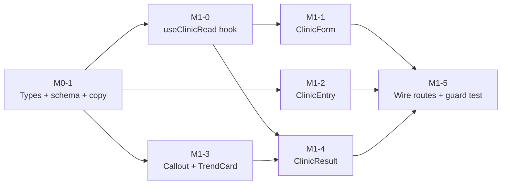

# Agent Plan: Clinic Mode

> **Generated from:** docs/PRD-clinic-mode.md + docs/HLD-clinic-mode.md + docs/ui-blueprints.md + design-system/pages/clinic.md
> **Date:** 2026-06-17
> **Test level:** Unit tests in build tasks (Q1 = A)
> **Task granularity:** Medium (Q2 = B)
> **Spike:** None — HLD risks are Medium; mitigated by an architecture-guard test (Q3 = B)
> **Git isolation:** Single feature branch `feature/clinic-mode` (Q4 = B — one contained feature)
> **Total tasks:** 8 across 2 milestones
> **Estimated total effort:** 14–20 agent-hours (partly parallelizable)
> **Max agents running simultaneously:** 4 (build + test + fix combined)

> ⚙️ **Defaults applied** because the chain was run end-to-end. Override any of the five settings above and I'll regenerate.

---

## How to use this plan

- **Milestone** = a deployable moment. After each, the app builds, lints, type-checks, and the feature demos.
- **Wave** = tasks that run in parallel. Launch all agents in a wave together.
- **Owns / Reads** = file contracts. No two same-wave tasks share an `Owns` file. Never `Owns` a `components/ui/` shell — those exist.
- **Done when** = machine-verifiable commands. Run it, read the output, then claim done (`superpowers:verification-before-completion`).
- **THE non-negotiable constraint:** nothing under `src/features/clinic/**` may import from `src/data/**`, `src/auth/**`, or `src/lib/supabase/**`. Clinic Mode stores nothing (docs/HLD-clinic-mode.md). M1-5 enforces this with a test.

---

## Execution options (Superpowers)

### Option A — Subagent-driven development (recommended, same session)
```
Invoke: superpowers:subagent-driven-development
Input: this PLAN-clinic-mode.md file
```

### Option B — Executing plans (parallel sessions)
```
Invoke: superpowers:executing-plans
Input: this PLAN-clinic-mode.md file
```

Both apply `superpowers:test-driven-development` (RED → GREEN → REFACTOR) per task.

---

## Milestone 0 — Contracts & Copy
*Goal: shared types, validation schema, and i18n copy are locked so all M1 agents work against a contract. No UI yet.*
*Run as: single agent (sequential)*

### M0-1 · Lock types, schema, and clinic copy · M
**Owns:**
- `src/features/clinic/types.ts` (finalize the existing shell)
- `src/features/clinic/clinicSchema.ts` (implement the Zod schema + cross-field refinements)
- `src/features/clinic/clinicSchema.test.ts` (new)
- `src/i18n/copy/en.ts` (add a `clinic` copy block — entry notice, form labels/helpers, result strings, disclaimer)
**Reads:**
- `docs/HLD-clinic-mode.md` §3 (types + business rules)
- `docs/PRD-clinic-mode.md` (acceptance criteria for input rules)
- `src/types/index.ts` (reuse `Sex`, `WeightEntry`), `src/features/growth/types.ts` (`ZResult`)
- `src/types/schemas.ts` (mirror existing Zod patterns)
- `src/i18n/copy/en.ts` (existing structure + `t()` accessor)
**Context:** Define the ephemeral contract every Clinic Mode agent consumes. Implement `clinicInputSchema` enforcing: DOB not future; sex required; 1–2 weights; each `measuredOn` on/after DOB and within WHO 0–730 days; second weight date on/after first; same-date pair blocked (velocity undefined). All UI copy lives in the i18n `clinic` block — no literal strings in components.
**TDD approach:** write `clinicSchema.test.ts` first (valid input, future DOB, out-of-range age, reversed dates, same-date pair, single-weight) → implement → refactor.
**Done when:**
- [ ] `clinicInputSchema` parses valid 1- and 2-weight inputs and rejects each invalid case with a field-scoped message
- [ ] `clinic` copy block exported and consumed via existing `t()` accessor
- [ ] Unit tests pass — confirm `N/N passing` in terminal output
- [ ] `npm run type-check` passes — `0 errors`; no `any` (grep confirms)
- [ ] `superpowers:verification-before-completion` gate: ran all commands, read actual output

---

## Milestone 1 — Clinic Mode end-to-end
*Goal: a clinician opens `/clinic`, enters DOB + sex + 1–2 weights, and gets the percentile/z-score, chart, trend, and catch-up read — with nothing stored.*



### Wave 0 — Core ephemeral hook *(single agent)*
*Depends on: M0-1. Everything reads this hook, so it lands first.*

#### M1-0 · Implement `useClinicRead` (in-memory state + derivation) · M
**Owns:** `src/features/clinic/useClinicRead.ts`, `src/features/clinic/useClinicRead.test.ts` (new)
**Reads:**
- `src/features/clinic/types.ts`, `src/features/clinic/clinicSchema.ts` (from M0-1)
- `src/lib/who/index.ts` (`weightToZResult`), `src/lib/growth/projection.ts` (`projectGrowth`)
- `docs/HLD-clinic-mode.md` §2 ephemeral contract
**Context:** Hold all Clinic Mode state in React state only. Derive `ClinicRead` synchronously via the reused pure domain: `weightToZResult` for percentile/z-score; `projectGrowth` for catch-up (amber `catch-up` below the 3rd line, green `maintenance` on/above); trend g/day from two differently-dated weights. **Must not import `data/`, `auth/`, `lib/supabase/`, or do any I/O.**
**TDD approach:** test single-weight (no trend/velocity), two-weight (trend + velocity), maintenance vs catch-up branch, same-date guard → implement → refactor.
**Done when:**
- [ ] `submit()` sets input and derives `read`; `reset()` clears both; single-weight omits `trend`
- [ ] Catch-up vs maintenance branch correct against known WHO reference points
- [ ] Unit tests pass — `N/N passing` in output
- [ ] `npm run type-check` passes — `0 errors`; no `any`, no `console.log` (grep confirms)
- [ ] `superpowers:verification-before-completion` gate: ran all commands, read actual output

### Wave 1 — Screens & presentational components *(3 agents in parallel)*
*Depends on: M1-0 (for M1-1), M0-1 (for M1-2, M1-3)*

#### M1-1 · ClinicForm (input + validation + submit) · M
**Owns:** `src/features/clinic/ClinicForm.tsx`, `src/features/clinic/ClinicForm.test.tsx` (new)
**Reads:**
- `design-system/MASTER.md`, `design-system/pages/clinic.md`
- `docs/ui-blueprints.md → Clinic Form`
- `src/components/ui/{input,button,card}.tsx`, `src/features/profile/SexSelector.tsx`, `src/features/growth/WeightForm.tsx` (row pattern)
- `src/features/clinic/{useClinicRead,clinicSchema}.ts`
**PRD story:** CLM-2, CLM-3, CLM-4
**Context:** RHF + `zodResolver(clinicInputSchema)`. DOB, `SexSelector` (+ "why we ask"), Weight #1, optional Weight #2 (add/remove), "Get read" (disabled until DOB+sex+weight#1 valid) → `useClinicRead().submit()` → navigate `/clinic/result`; "Clear" resets. Visible labels, errors below fields, soft-warn implausible weight. Copy via `t()`.
**Done when:**
- [ ] Valid 1- and 2-weight submissions navigate to `/clinic/result` with state set
- [ ] Each invalid case shows its field-scoped message; "Get read" disabled until min-valid
- [ ] Unit/component tests pass — `N/N passing`
- [ ] `npm run type-check` + `npm run lint` pass — `0 errors`; no `any`/`console.log`
- [ ] `superpowers:verification-before-completion` gate: ran all commands, read actual output

#### M1-2 · ClinicEntry (intro + notice + CTA) · S
**Owns:** `src/features/clinic/ClinicEntry.tsx`, `src/features/clinic/ClinicEntry.test.tsx` (new)
**Reads:**
- `design-system/MASTER.md`, `design-system/pages/clinic.md`, `docs/ui-blueprints.md → Clinic Entry`
- `src/components/ui/{button,card}.tsx`, `src/components/ui/medical-disclaimer.tsx`
**PRD story:** CLM-1, CLM-9
**Context:** Static screen, Apple anchor. Heading + one-line description, notice card ("nothing is saved" + "supports, not replaces, clinical judgment"), primary CTA "Start a read" → `/clinic/read`, "Back to growUp" link → `/`. Copy via `t()`.
**Done when:**
- [ ] CTA navigates to `/clinic/read`; back link to `/`; notice text present and ≥4.5:1
- [ ] Tests pass — `N/N passing`; `type-check` + `lint` `0 errors`
- [ ] `superpowers:verification-before-completion` gate: ran all commands, read actual output

#### M1-3 · PercentileZScoreCallout + TrendCard (presentational) · S
**Owns:** `src/features/clinic/PercentileZScoreCallout.tsx`, `src/features/clinic/TrendCard.tsx`, plus their `*.test.tsx` (new)
**Reads:**
- `design-system/MASTER.md`, `design-system/pages/clinic.md`, `docs/ui-blueprints.md → Clinic Result`
- `src/features/clinic/types.ts`, `src/features/growth/types.ts`
**PRD story:** CLM-5 (callout), CLM-7 (trend)
**Context:** Pure presentational. Callout: big percentile (`--text-display`) + z-score + read-aloud sentence; below-3rd → caution amber (icon + words), on/above → accent green — never color alone. TrendCard: direction + g/day, gain green / loss amber / flat muted, with icon + words.
**Done when:**
- [ ] Callout renders percentile/z-score + sentence; amber/green branch correct and paired with icon + text
- [ ] TrendCard renders all three directions correctly
- [ ] Tests pass — `N/N passing`; `type-check` + `lint` `0 errors`
- [ ] `superpowers:verification-before-completion` gate: ran all commands, read actual output

### Wave 2 — Result composition *(single agent)*
*Depends on: M1-0, M1-3*

#### M1-4 · ClinicResult (compose + reuse chart/projection) · M
**Owns:** `src/features/clinic/ClinicResult.tsx`, `src/features/clinic/ClinicResult.test.tsx` (new)
**Reads:**
- `design-system/MASTER.md`, `design-system/pages/clinic.md`, `docs/ui-blueprints.md → Clinic Result`
- `src/features/clinic/{useClinicRead,PercentileZScoreCallout,TrendCard,types}.ts(x)`
- `src/features/growth/{WeightChart,ProjectionCard}.tsx`
- `src/components/ui/{card,empty-state,button}.tsx`, `src/components/ui/medical-disclaimer.tsx`
**PRD story:** CLM-5, CLM-6, CLM-7, CLM-8, CLM-9
**Context:** If `!input || !read` → `<Navigate to="/clinic/read" replace />`. Build ephemeral `WeightEntry[]` (synthetic ids, placeholder childId/ownerId, **never persisted**) to feed reused `WeightChart` + `ProjectionCard`. Compose callout → chart → TrendCard (two weights) or `EmptyState` "Add a second weight…" (one weight) → ProjectionCard → disclaimer → "New read" (`reset()` + navigate `/clinic/read`).
**Done when:**
- [ ] Two-weight read shows callout, chart with both points, TrendCard, catch-up/maintenance
- [ ] One-weight read shows EmptyState for trend; direct nav with no input redirects to `/clinic/read`
- [ ] "New read" clears state and returns to a blank form
- [ ] Component tests pass — `N/N passing`; `type-check` + `lint` `0 errors`; no `any`/`console.log`
- [ ] `superpowers:verification-before-completion` gate: ran all commands, read actual output

### Wave 3 — Wire + guard *(single agent)*
*Depends on: M1-1, M1-2, M1-4*

#### M1-5 · Add routes, entry link, and ephemeral-import guard test · M
**Owns:**
- `src/app/routes.tsx` (add lazy `/clinic`, `/clinic/read`, `/clinic/result` **outside** `PrimaryLayout`)
- `src/app/routing.test.tsx` (extend)
- `src/features/clinic/no-persistence.test.ts` (new — architecture guard)
- the parent app entry point that links to `/clinic` (e.g. Profile or a header link — confirm location while wiring)
**Reads:** all `src/features/clinic/*`, `src/app/routes.tsx`, `src/app/PrimaryLayout.tsx`
**Context:** Lazy-load the three clinic screens like existing routes, but register them outside the child-guarded `PrimaryLayout` (no tabs, no onboarding redirect). Add a discoverable entry link into Clinic Mode. Add a guard test asserting no file under `src/features/clinic/**` imports from `src/data/**`, `src/auth/**`, or `src/lib/supabase/**` (the ephemeral contract from docs/HLD-clinic-mode.md §8).
**Done when:**
- [ ] `/clinic`, `/clinic/read`, `/clinic/result` resolve; `/clinic/result` without input redirects to `/clinic/read`
- [ ] Guard test fails if a forbidden import is added, passes now — confirm in output
- [ ] Full happy path (open → enter 2 weights → read) works in `npm run dev`
- [ ] `npm run build` exit 0; `npm run type-check` `0 errors`; `npm run lint` `0 errors`; full `npm test` green
- [ ] `superpowers:verification-before-completion` gate: confirmed all from actual terminal output

---

## Milestone 2 — Polish & open question
*Goal: a11y/reduced-motion pass and resolve the analytics blocker for the success metric.*

#### M2-1 · A11y + reduced-motion pass · S
**Owns:** the three clinic screens + presentational components (touch-ups only), `src/features/clinic/*.test.tsx`
**Reads:** `design-system/MASTER.md` accessibility constraints, `docs/ui-blueprints.md` a11y rows
**Context:** Verify focus rings, ≥44×44px targets, visible labels, status never color-alone, `prefers-reduced-motion` honored, screen-reader text summary near the chart.
**Done when:**
- [ ] `eslint-plugin-jsx-a11y` clean on clinic files; reduced-motion respected; tests pass `N/N`
- [ ] `superpowers:verification-before-completion` gate: ran all commands, read actual output

#### M2-2 · Resolve analytics for time-to-insight (BLOCKED — needs decision) · S
**Owns:** TBD pending decision
**Reads:** docs/PRD-clinic-mode.md §11, docs/HLD-clinic-mode.md §9
**Context:** ⛔ **Open question / blocker:** which anonymous, non-identifying events (if any) may be emitted to measure the <60s time-to-insight north star, given "nothing is stored"? No instrumentation until decided.
**Done when:**
- [ ] Decision recorded; if approved, an anonymous timing event from `/clinic/read` open → `/clinic/result` render is wired with no PII
- [ ] `superpowers:verification-before-completion` gate: ran all commands, read actual output

---

## Backlog — V1.1
*Deferred from MVP (docs/PRD-clinic-mode.md §5 V1.1).*

| Story ID | Title | Estimated effort | Blocks |
|---|---|---|---|
| CLM-12 | QR/link hand-off to parent's growUp | M | Parent retention loop |
| CLM-13 | On-the-spot printable one-pager (no storage) | M | Family leaves with the read |
| CLM-14 | Enter more than two weights | S | Longer-trend follow-up visits |

---

## Quick reference — all tasks by wave

| Task | Milestone | Wave | Effort | Parallel with |
|---|---|---|---|---|
| M0-1 | Contracts | — | M | — |
| M1-0 | Clinic Mode | 0 | M | — |
| M1-1 | Clinic Mode | 1 | M | M1-2, M1-3 |
| M1-2 | Clinic Mode | 1 | S | M1-1, M1-3 |
| M1-3 | Clinic Mode | 1 | S | M1-1, M1-2 |
| M1-4 | Clinic Mode | 2 | M | — |
| M1-5 | Clinic Mode | 3 | M | — |
| M2-1 | Polish | — | S | M2-2 |
| M2-2 | Polish | — | S | M2-1 (blocked on decision) |

---

> To execute: run `superpowers:subagent-driven-development` (same session) or `superpowers:executing-plans` (separate sessions). Each agent uses `superpowers:test-driven-development` and `superpowers:verification-before-completion`.
> Next: `/tests-for-agents`.
