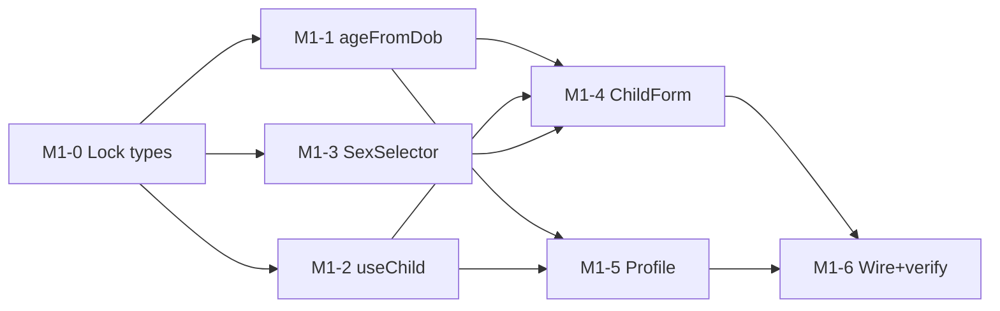
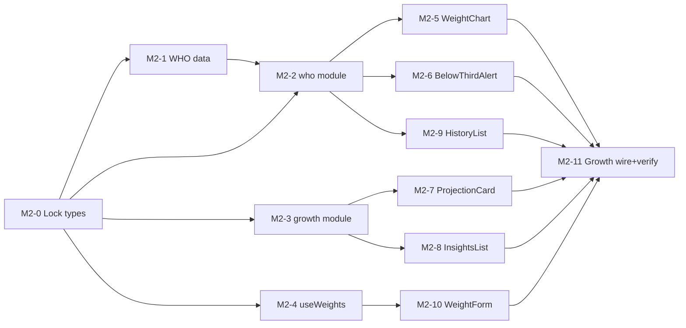
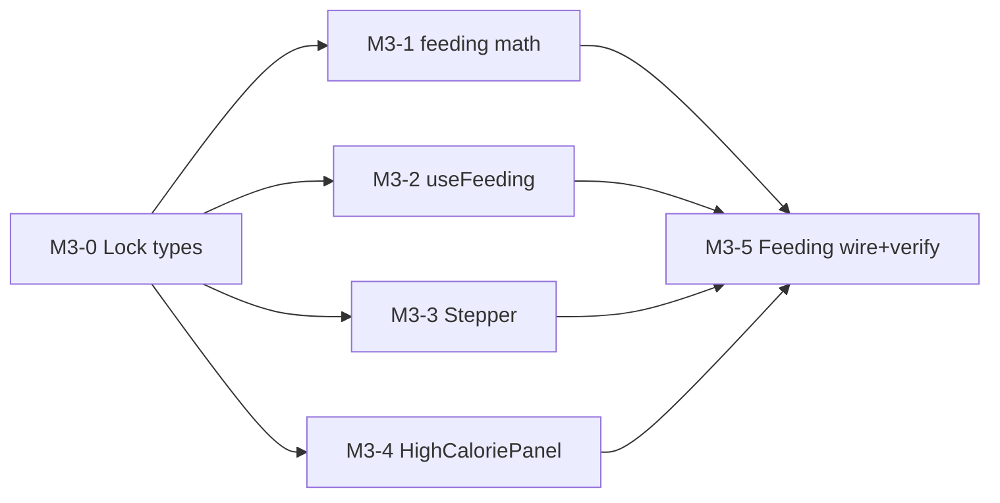

# Agent Plan: GrowUp

> **Generated from:** docs/PRD.md + docs/HLD.md + design-system/MASTER.md + docs/ui-blueprints.md
> **Date:** 2026-06-09
> **Test level:** Unit tests written by build agents (pure functions)
> **Task granularity:** Medium (2–4h)
> **Git isolation:** Worktrees (Superpowers — `superpowers:using-git-worktrees`)
> **Total tasks:** 35 across 6 milestones
> **Estimated total effort:** ~70–95 agent-hours (much of M1–M3 parallelizable)
> **Max agents running simultaneously:** 4 (build + test + fix combined)

---

## How to use this plan

- **Milestone** = a deployable moment. After each, the app builds, deploys, and is demoable.
- **Wave** = tasks that run in parallel. Launch all agents in a wave at once (max 4 active).
- **Owns / Reads** = file contracts. Never modify another task's `Owns` file in the same wave. `/components/ui/*` shells already exist (from `/create-ui`) — never list them in `Owns`.
- **Done when** = machine-verifiable criteria. Run the command, read the output, then claim done (`superpowers:verification-before-completion`).
- **Worktrees** = each agent runs in its own isolated workspace (`superpowers:using-git-worktrees`).
- **Debugging** = blocked after 2 attempts → `superpowers:systematic-debugging` before escalating.
- **Execution** = `superpowers:subagent-driven-development` (same session) or `superpowers:executing-plans` (separate sessions). TDD (RED→GREEN→REFACTOR) per task.

**Global constraints for every task** (from CLAUDE.md + MASTER.md):
- TypeScript strict, **no `any`**, **no `@ts-ignore`**, explicit return types, **no `console.log`** in committed code.
- UI tasks: read `design-system/MASTER.md` + the blueprint section; use **only design tokens** (no raw hex/px/font); **logical CSS** only (RTL-ready); **no hardcoded UI strings** — all copy via `t()` in `src/i18n/copy/en.ts`.
- A11y Priority-1 checklist in MASTER.md is part of every UI task's Done-when.

---

## Execution options (Superpowers)

**Option A — Subagent-driven (recommended, same session):** invoke `superpowers:subagent-driven-development` with this PLAN.md. Fresh subagent per task, 2-stage review, then `superpowers:finishing-a-development-branch`.
**Option B — Executing plans (separate sessions):** invoke `superpowers:executing-plans` with this PLAN.md.

---

## Milestone 0 — Project Setup
*Goal: deployable skeleton — tabs render, disclaimer shows, onboarding prompts "Add your baby"; no features. CI green, deployed to staging.*
*Run as: single agent, sequential. Run `superpowers:using-git-worktrees` first.*

### M0-1 · Scaffold Vite + React + TS + Tailwind + tooling · M
**Owns:** `package.json`, `vite.config.ts`, `tsconfig.json`, `tsconfig.node.json`, `index.html`, `src/main.tsx`, `src/vite-env.d.ts`, `vitest.config.ts`, `.gitignore`, `.eslintrc.cjs`
**Reads:** `docs/HLD.md` (§1 stack, §5 folders), `src/index.css` (already exists), `design-system/MASTER.md`
**Context:** Initialize the project per HLD. `npm create vite@latest . -- --template react-ts`; install `react-router-dom recharts react-hook-form zod`; dev-install `tailwindcss @tailwindcss/vite vitest @testing-library/react @testing-library/jest-dom jsdom`. Wire Tailwind v4 via `@tailwindcss/vite`; ensure `src/index.css` is imported in `main.tsx`. Set `"strict": true`. Configure Vitest (jsdom env).
**Done when:**
- [ ] `npm run build` exits 0 (read terminal output)
- [ ] `npm run type-check` (`tsc --noEmit`) shows 0 errors
- [ ] `npm run test` runs Vitest (0 tests passing is OK)
- [ ] `npm run dev` serves a page using the Nunito Sans/Varela Round fonts and `--color-background`
- [ ] `superpowers:verification-before-completion` gate passed

### M0-2 · Core domain types + Zod schemas · S
**Owns:** `src/types/index.ts`, `src/types/schemas.ts`
**Reads:** `docs/HLD.md` (§3 Data Model)
**Context:** Define the shared entities exactly as the HLD data model specifies: `Child`, `WeightEntry`, `FeedingConfig` (each with `id`, `ownerId`, UTC ISO `createdAt`/`updatedAt`; weight as **integer grams**; `sex: 'male' | 'female'`). Add matching Zod schemas (used for form validation AND repository read-validation). These types are the contract for all later milestones.
**Done when:**
- [ ] All entity interfaces + Zod schemas exported
- [ ] `npm run type-check` 0 errors; grep finds no `any`
- [ ] Zod schemas parse a valid sample and reject an invalid one (tiny unit test, N/N passing)
- [ ] `superpowers:verification-before-completion` gate passed

### M0-3 · Data + auth + i18n seams · M
**Owns:** `src/data/repository/types.ts`, `src/data/repository/localStorageRepository.ts`, `src/data/repository/index.ts`, `src/auth/AuthContext.tsx`, `src/i18n/LocaleContext.tsx`, `src/i18n/t.ts`, `src/i18n/copy/en.ts`
**Reads:** `src/types/index.ts`, `src/types/schemas.ts`, `docs/HLD.md` (§10 Forward Compatibility)
**Context:** Build the three forward-compat seams from HLD §10. (1) **Repository interface** — async methods for children/weights/feedingConfig CRUD; `LocalStorageRepository` implementation that validates with Zod on read and throws typed errors on write failure; `index.ts` exports the chosen instance (the swap point for a future API repo). (2) **AuthContext** returning an anonymous local user with a stable generated UUID (stamped as `ownerId`). (3) **i18n**: `t()` accessor reading `copy/en.ts`, `LocaleContext` exposing `locale='en'` + `dir='ltr'`.
**Done when:**
- [ ] Repository interface + localStorage impl pass round-trip unit tests (write→read→update→delete), N/N passing
- [ ] Malformed JSON on read is handled gracefully (test asserts no throw, returns empty)
- [ ] `t('app.name')` returns the English string from `copy/en.ts`
- [ ] `npm run type-check` 0 errors; no `any`
- [ ] `superpowers:verification-before-completion` gate passed

### M0-4 · App shell: router, BottomTabs, MedicalDisclaimer, guards · M
**Owns:** `src/app/App.tsx`, `src/app/routes.tsx`, `src/components/ui/bottom-tabs.tsx`, `src/components/ui/medical-disclaimer.tsx`
**Reads:** `design-system/MASTER.md`, `docs/ui-blueprints.md` (Shared + Onboarding), `src/data/repository/index.ts`, `src/auth/AuthContext.tsx`, `src/i18n/t.ts`
**Context:** Wire React Router with routes `/onboarding`, `/profile`, `/profile/child`, `/growth`, `/feeding`, and `/` redirecting to `/growth` (child exists) or `/onboarding`. Build `BottomTabs` (3 tabs, SVG icons + labels, `aria-current`, ≥44×44px, logical positioning) and the non-dismissable `MedicalDisclaimer` (footer + onboarding block, warm wording per PRD). Screen bodies can be placeholder text — features come later.
**Done when:**
- [ ] App boots to `/onboarding` with no stored child; BottomTabs navigate between the 3 tabs
- [ ] MedicalDisclaimer visible and non-dismissable; text contrast ≥4.5:1
- [ ] `npm run build` exits 0; `npm run type-check` 0 errors
- [ ] Deployed to Vercel staging — URL responds
- [ ] `superpowers:verification-before-completion` gate passed

---

## Milestone 0.5 — Spike: WHO LMS data accuracy *(gates all feature math)*
*Goal: prove the LMS method + embedded data reproduce official WHO reference percentiles BEFORE building features. Output = a go/no-go decision + a validated math module. If it fails, revisit the data approach before M1.*
*Run as: single agent. Run `superpowers:using-git-worktrees` first.*

### M0.5-1 · Validate LMS math against WHO reference values · M
**Owns:** `spike-notes.md`, `src/lib/who/lms.ts`, `src/lib/who/lms.test.ts`, `src/data/who/sample.ts`
**Reads:** `docs/HLD.md` (§4 Domain Logic, §8 Risks), `src/types/index.ts`
**Context:** Embed a SAMPLE slice of official WHO weight-for-age LMS values (boys + girls, at several ages incl. 0, 6, 12, 24 months). Implement `weightToZ` (`z = ((X/M)^L − 1)/(L·S)`, with `L≈0` log fallback), `zToPercentile` (normal CDF), and `percentileWeight` (inverse LMS). Verify against WHO's **published** reference weights for the 3rd/15th/50th/85th/97th percentiles (z = −1.8808 / −1.0364 / 0 / 1.0364 / 1.8808) at those ages. This is the project's #1 risk (HLD §8).
**Done when:**
- [ ] `percentileWeight(0, lms)` equals `M` exactly for each sample age
- [ ] Computed weights at the 5 standard percentiles match WHO's published table values within rounding tolerance (assert in tests), N/N passing
- [ ] `zToPercentile(0)=50`, `zToPercentile(1.8808)≈97`, `zToPercentile(-1.8808)≈3` within tolerance
- [ ] `spike-notes.md` records: data source URL, tolerance used, results table, **GO/NO-GO** decision + next step
- [ ] `superpowers:verification-before-completion` gate passed

> **Gate:** M1+ do not start until M0.5 is GO. If NO-GO, escalate with `spike-notes.md` before any feature work.

---

## Milestone 1 — Child Profile
*Goal: a parent can add, view, edit, and delete their baby (name, sex, DOB) and see the computed age; data persists locally.*

### Wave 0 — Lock interfaces *(single agent)*
#### M1-0 · Profile feature types · S
**Owns:** `src/features/profile/types.ts`
**Reads:** `src/types/index.ts`, `docs/PRD.md` (Child Profile epic)
**Context:** Define `ChildFormValues` + the profile Zod form schema (name required; sex required; DOB not in future), reusing core `Child`.
**Done when:** types exported; `type-check` 0 errors; no `any`; verification gate passed.

### Wave 1 — 3 agents in parallel *(depends on M1-0; each in its own worktree)*
#### M1-1 · `ageFromDob` utility · S — PRD: PROF-1
**Owns:** `src/lib/growth/age.ts`, `src/lib/growth/age.test.ts`
**Reads:** `src/types/index.ts`
**Context:** Pure function: DOB + reference date → `{ days, weeks, months }` completed. Calendar-date based (no time-of-day). TDD.
**Done when:** unit tests cover newborn, month/leap-year boundaries, exact-month — N/N passing; `type-check` 0 errors; no `any`; verification gate passed.

#### M1-2 · `useChild` hook · M — PRD: PROF-2, PROF-3
**Owns:** `src/lib/hooks/useChild.ts`, `src/lib/hooks/useChild.test.ts`
**Reads:** `src/data/repository/index.ts`, `src/auth/AuthContext.tsx`, `src/types/index.ts`
**Context:** Hook to load/create/update/delete the current child via the repository, stamping `ownerId` + timestamps. Async. TDD with a mock repository.
**Done when:** create/update/delete round-trip tested (N/N passing); persists across reload (manual note); `type-check` 0 errors; no `any`; verification gate passed.

#### M1-3 · `SexSelector` component · S — PRD: PROF-1
**Owns:** `src/features/profile/SexSelector.tsx`
**Reads:** `design-system/MASTER.md`, `docs/ui-blueprints.md` (Add/Edit Child), `src/i18n/t.ts`
**Context:** Segmented male/female control with radio semantics, a group label, and a "why we ask" helper (WHO differs by sex). Tokens only; ≥44×44px; logical CSS.
**Done when:** keyboard-selectable with visible focus + group label; copy via `t()`; `type-check` 0 errors; verification gate passed.

### Wave 2 — 2 agents in parallel *(depends on M1-1, M1-2, M1-3)*
#### M1-4 · ChildForm screen (add/edit/delete) · M — PRD: PROF-1, PROF-2
**Owns:** `src/features/profile/ChildForm.tsx` (fill the existing shell)
**Reads:** `design-system/MASTER.md`, `docs/ui-blueprints.md` (Add/Edit Child), `src/features/profile/types.ts`, `src/features/profile/SexSelector.tsx`, `src/lib/hooks/useChild.ts`, ui shells (Input/Button/Card/Modal/Toast)
**Context:** Implement the form with react-hook-form + Zod (M1-0 schema). DOB cannot be future; sex required with explanation. Save/Cancel; edit mode adds Delete (Modal confirm). Errors below each field; save-failure Toast. Copy via `t()`.
**Done when:** add + edit + delete all work against the repository; future-DOB blocked with message below field; `type-check` 0 errors; no `any`/`console.log`; a11y checklist met; verification gate passed.

#### M1-5 · Profile screen · M — PRD: PROF-2
**Owns:** `src/features/profile/Profile.tsx` (fill the existing shell)
**Reads:** `design-system/MASTER.md`, `docs/ui-blueprints.md` (Profile), `src/lib/hooks/useChild.ts`, `src/lib/growth/age.ts`, ui shells (Card/Button/EmptyState)
**Context:** Show name + computed age + sex/DOB; Edit → `/profile/child`; EmptyState when no child; persistent disclaimer footer. Leave a clearly-commented future slot for child switcher/account.
**Done when:** renders child + correct age; empty state links to add; `type-check` 0 errors; a11y met; verification gate passed.

### Wave 3 — Wire + verify *(single agent; depends on M1-4, M1-5)*
#### M1-6 · Profile epic integration · S
**Owns:** `src/features/profile/Onboarding.tsx` (fill shell), `src/app/routes.tsx` (wire guards)
**Reads:** all M1 outputs
**Context:** Wire onboarding→add→profile flow and the `/` redirect. Verify PROF-1/2/3 happy path end-to-end.
**Done when:** fresh load → onboarding → add baby → lands on Growth/Profile with age shown; reload persists; `npm run build` 0; deployed to staging; verification gate passed.

---

## Milestone 2 — WHO Weight Tracking *(core value; largest milestone)*
*Goal: a parent can log weights, see exact WHO percentile + z-score, view the chart vs. percentile curves, get a gentle below-3rd alert, a transparent projection, and starter insights.*

### Wave 0 — Lock interfaces *(single agent)*
#### M2-0 · Growth domain types + LMS data shape · S
**Owns:** `src/features/growth/types.ts`, `src/data/who/types.ts`
**Reads:** `spike-notes.md`, `src/lib/who/lms.ts`, `docs/HLD.md` (§4)
**Context:** Lock the LMS data table shape (so data + functions parallelize) and result types: `ZResult {z, percentile}`, `CurvePoint`, `ProjectionResult`, `Insight`. Promote the spike's validated function signatures.
**Done when:** types exported; `type-check` 0 errors; no `any`; verification gate passed.

### Wave 1 — 4 agents in parallel *(depends on M2-0)*
#### M2-1 · Embed full WHO weight-for-age LMS data · M — PRD: WHO-2
**Owns:** `src/data/who/boys.ts`, `src/data/who/girls.ts`, `src/data/who/index.ts`, `src/data/who/data.test.ts`
**Reads:** `src/data/who/types.ts`, `spike-notes.md`
**Context:** Embed official WHO weight-for-age LMS values, boys & girls, **0–24 months** (per-month, plus per-week 0–13 weeks for early precision). Add data-integrity tests (monotonic ages; L/M/S present and plausible; no gaps).
**Done when:** data-integrity tests N/N passing; spot-checks at 0/6/12/24mo match WHO published M values; `type-check` 0 errors; verification gate passed.

#### M2-2 · Finalize `who` math module · M — PRD: WHO-2, WHO-3
**Owns:** `src/lib/who/index.ts`, `src/lib/who/lmsForAge.ts`, `src/lib/who/curves.ts`, tests
**Reads:** `src/data/who/types.ts`, `src/lib/who/lms.ts` (from spike), `src/features/growth/types.ts`
**Context:** `lmsForAge(sex, ageDays)` with **linear interpolation** between tabulated ages; re-export `weightToZ/zToPercentile/percentileWeight`; `curveSeries(sex, ageRange)` producing the 5 percentile curves. (Consumes M2-1 data via the locked shape — works against the interface; integrate real data at wire time if M2-1 not yet merged.)
**Done when:** interpolation tested at between-table ages; curve series returns 5 series across 0–24mo; `type-check` 0 errors; no `any`; verification gate passed.

#### M2-3 · `growth` analysis module · M — PRD: WHO-4, WHO-5, WHO-6
**Owns:** `src/lib/growth/velocity.ts`, `src/lib/growth/projection.ts`, `src/lib/growth/insights.ts`, tests
**Reads:** `src/features/growth/types.ts`, `src/lib/who/index.ts` (signatures), `src/lib/constants`
**Context:** `velocity` (g/day via linear regression over last ≤4 points), `project` (~28-day forecast + percentile), `gainToReach3rd` (daily/weekly grams to the 3rd-percentile line), `insights` (starter cards: loss between visits, slow velocity, percentile drop across 2+ measurements) with a clearly-commented **EXTENSION POINT**.
**Done when:** unit tests cover <2 points (graceful), steady gain, loss, and a percentile drop — N/N passing; math matches hand-computed examples; `type-check` 0 errors; verification gate passed.

#### M2-4 · `useWeights` hook · M — PRD: WHO-1
**Owns:** `src/lib/hooks/useWeights.ts`, tests
**Reads:** `src/data/repository/index.ts`, `src/auth/AuthContext.tsx`, `src/types/index.ts`
**Context:** CRUD weights for a child via repository (grams integer; date within 0–24mo & ≥DOB validated with Zod); sorted history. Async; TDD with mock repo.
**Done when:** create/edit/delete + ordering tested (N/N passing); out-of-range date rejected; `type-check` 0 errors; verification gate passed.

### Wave 2 — up to 4 agents in parallel *(depends on Wave 1 as per graph)*
#### M2-5 · WeightChart (Recharts) · M — PRD: WHO-3
**Owns:** `src/features/growth/WeightChart.tsx`
**Reads:** `design-system/MASTER.md`, `design-system/pages/growth.md`, `docs/ui-blueprints.md` (Growth), `src/lib/who/index.ts`, `src/features/growth/types.ts`, ui shells (Card)
**Context:** Plot the 5 WHO curves + the baby's points, readable at 375px. Provide an **accessible text/table fallback** of latest values (chart not the sole source). Tokens only.
**Done when:** renders curves + points from sample data; fallback table present; reduced-motion safe; `type-check` 0 errors; verification gate passed.

#### M2-6 · BelowThirdAlert · M — PRD: WHO-4
**Owns:** `src/features/growth/BelowThirdAlert.tsx`
**Reads:** `design-system/MASTER.md`, `docs/ui-blueprints.md` (Growth), `src/lib/who/index.ts`, `src/i18n/t.ts`, ui shells (Card/Badge)
**Context:** Conditional gentle alert (latest < 3rd pct): current percentile, **grams to reach the 3rd-percentile line**, trend, hopeful next step. **Caution amber, icon + words, never red, never color-only.** Warm copy via `t()`.
**Done when:** shows only when below 3rd; states percentile + gram gap + trend; role="status"; amber contrast ≥4.5:1; `type-check` 0 errors; verification gate passed.

#### M2-7 · ProjectionCard · M — PRD: WHO-5
**Owns:** `src/features/growth/ProjectionCard.tsx`
**Reads:** `design-system/MASTER.md`, `docs/ui-blueprints.md` (Growth), `src/lib/growth/projection.ts`, ui shells (Card)
**Context:** Show velocity (g/day), ~4-week forecast vs. curves, daily/weekly gain to reach 3rd; **math shown transparently**; graceful "<2 measurements" message.
**Done when:** renders from sample; explains assumptions; handles <2 points; tokens only; `type-check` 0 errors; verification gate passed.

#### M2-8 · InsightsList + InsightCard · M — PRD: WHO-6
**Owns:** `src/features/growth/InsightsList.tsx`, `src/features/growth/InsightCard.tsx`
**Reads:** `design-system/MASTER.md`, `docs/ui-blueprints.md` (Growth), `src/lib/growth/insights.ts`, ui shells (Card/Badge)
**Context:** Render starter insight cards in warm language + a clearly-commented `EXTENSION POINT` for adding more.
**Done when:** renders starter cards; extension point commented; icon+text (not color-only); `type-check` 0 errors; verification gate passed.

#### M2-9 · WeightHistoryList + WeightRow · M — PRD: WHO-1, WHO-2
**Owns:** `src/features/growth/WeightHistoryList.tsx`, `src/features/growth/WeightRow.tsx`
**Reads:** `design-system/MASTER.md`, `docs/ui-blueprints.md` (Growth), `src/lib/who/index.ts`, ui shells (Card/EmptyState/Button)
**Context:** List entries (date, weight, percentile, z) with ≥44×44px labelled edit/delete; EmptyState when none.
**Done when:** rows show computed percentile+z; edit/delete labelled; empty state present; `type-check` 0 errors; verification gate passed.

#### M2-10 · WeightForm modal · M — PRD: WHO-1
**Owns:** `src/features/growth/WeightForm.tsx` (fill shell)
**Reads:** `design-system/MASTER.md`, `docs/ui-blueprints.md` (Add/Edit Weight), `src/lib/hooks/useWeights.ts`, ui shells (Modal/Input/Button/Toast)
**Context:** RHF + Zod; weight (inputMode decimal, stored grams) + date (default today, range-validated); add/edit/delete; errors below fields; save-fail Toast.
**Done when:** add/edit/delete work; out-of-range date blocked with message; modal focus-trap + Escape; `type-check` 0 errors; verification gate passed.

### Wave 3 — Wire + verify *(single agent; depends on all Wave 2)*
#### M2-11 · Growth screen integration · M
**Owns:** `src/features/growth/Growth.tsx` (fill shell)
**Reads:** all M2 outputs
**Context:** Assemble header (latest weight + percentile + z), BelowThirdAlert, WeightChart, ProjectionCard, InsightsList, WeightHistoryList, and the WeightForm modal into the live Growth screen. Verify WHO-1..6 end-to-end with real entries.
**Done when:** add a weight → chart, percentile, alert (if applicable), projection, insights, history all update correctly; empty/loading/error states correct; `npm run build` 0; deployed; verification gate passed.

---

### M2-12 · Add Z-score trajectory chart · M — PRD: WHO-2, WHO-3, WHO-7
*Added post-MVP. Epic: WHO Weight Tracking.*
**Owns:** `src/features/growth/ZScoreChart.tsx`, `src/features/growth/ZScoreChart.test.tsx`, `src/lib/growth/measurements.ts`, `src/lib/growth/measurements.test.ts`, `src/features/growth/Growth.tsx`, `src/i18n/copy/en.ts`
**Reads:** `src/features/growth/WeightChart.tsx`, `src/lib/who/index.ts`, `src/lib/growth/age.ts`, `docs/ui-blueprints.md` (Growth — Z-score trajectory view), `design-system/MASTER.md`
**Context:** Let a parent toggle the Growth chart between **Weight** and **Z-score**. The Z-score view plots each measurement exactly once at its exact age (NO snapping — `WeightChart` snaps baby points to the 14-day curve grid, so do NOT reuse its mapping). Introduce a shared pure helper `deriveMeasurements(entries, sex, dateOfBirth)` returning per-entry `{ ageDays, ageLabel, weightGrams, z, percentile, dateMeasured }` (used by `ZScoreChart` for both points and fallback; refactoring `WeightChart`/`WeightRow`/`BelowThirdAlert` onto it is an optional later follow-up). Reference lines at z = 0/−2/−3 (calm tokens, never red). Y-domain `[min(dataMin,−3)−0.5, max(dataMax,0)+0.5]`.
**Done when:**
- [ ] `deriveMeasurements` unit-tested (exact per-entry z/percentile; `z≈0` for a known WHO median `M` weight; two close entries stay two points) — N/N passing
- [ ] Growth shows a `Weight | Z-score` segmented control only when entries exist; default Weight; Weight view unchanged
- [ ] Z-score view: 1 entry → one dot; 2+ → connected line; labelled 0/−2/−3 lines; fallback table with date/age/weight/z(2dp)/percentile
- [ ] all new copy via `t()` in `en.ts`
- [ ] `npm run type-check`, `npm run test`, `npm run lint`, `npm run build` all pass
- [ ] `superpowers:verification-before-completion` gate passed

---

### M2-13 · Import weights from Nara Baby CSV · M — PRD: WHO-8
*Added post-MVP. Epic: WHO Weight Tracking. Scope: weights only for now.*
**Owns:** `src/lib/import/naraBaby.ts`, `src/lib/import/naraBaby.test.ts`, `src/features/growth/ImportNaraBaby.tsx`, `src/features/growth/ImportNaraBaby.test.tsx`, `src/features/growth/Growth.tsx`, `src/i18n/copy/en.ts`
**Reads:** `src/lib/hooks/useWeights.ts` (`isWeightDateValid`, add/edit), `src/types/index.ts`, `docs/export_narababy_ori_20260610.csv` (real sample), `design-system/MASTER.md`
**Context:** Nara Baby exports a CSV where weights are rows with `Type = "Growth"` and a non-empty `[Growth] Weight` (KG) + `Start Date/time` (`YYYY-MM-DD HH:MM:SS`). Build a **pure parser** `parseNaraBabyWeights(csvText): { dateMeasured: string; weightGrams: number }[]` (RFC4180-ish CSV handling for quoted fields; KG→grams, LB→grams defensively; date = first 10 chars; ignore non-Growth and weightless Growth rows; throw a typed error if the Nara header columns are absent). UI: an **"Import from Nara Baby"** button on the Growth screen → `.csv` file picker → a confirm-preview modal showing counts (new / will-update-existing-date / skipped-out-of-0–24mo), then import into the current child via `useWeights` (**overwrite** existing same-date entries via `editWeight`, add the rest). Imports weights only — never touches the child profile.
**Done when:**
- [ ] Parser unit-tested with a small fixture AND the real `docs/export_narababy_ori_20260610.csv` (asserts 20 weights, KG→grams, dates `YYYY-MM-DD`); malformed/non-Nara input → typed error
- [ ] Growth shows an "Import from Nara Baby" action; selecting the sample CSV previews counts and imports the in-range weights into the current child
- [ ] Existing same-date entries are overwritten; out-of-range dates skipped + reported; success toast
- [ ] all new copy via `t()`; no inline styles; tokens + logical CSS; a11y (labelled file input/button, modal)
- [ ] `npm run type-check`, `npm run test`, `npm run lint`, `npm run build` all pass
- [ ] `superpowers:verification-before-completion` gate passed

---

## Milestone 3 — Feeding Calculator
*Goal: a parent enters weight → daily ml range + per-feed amount; high-calorie mode delivers a calorie-matched (lower) volume.*

### Wave 0 — Lock interfaces *(single agent)*
#### M3-0 · Feeding types + constants · S
**Owns:** `src/features/feeding/types.ts`, `src/lib/constants/feeding.ts`
**Reads:** `docs/PRD.md` (Feeding epic), `src/types/index.ts`
**Context:** Result types + named constants: `ML_PER_KG_MIN=120`, `ML_PER_KG_MAX=200`, `DEFAULT_FEEDS_PER_DAY=8`, `STANDARD_KCAL_PER_ML=0.67`, `KCAL_PER_OZ_STANDARD=20`.
**Done when:** exported; `type-check` 0 errors; no magic numbers downstream; verification gate passed.

### Wave 1 — 4 agents in parallel *(depends on M3-0)*
#### M3-1 · Feeding math module · M — PRD: FEED-1, FEED-3
**Owns:** `src/lib/feeding/index.ts`, tests
**Reads:** `src/lib/constants/feeding.ts`, `src/features/feeding/types.ts`
**Context:** `dailyVolumeRange(weightKg)`, `perFeed(range, feeds)`, `calorieAdjustedRange(weightKg, kcalPerMl)` returning calorie target + the matched (lower for concentrated formula) volume. Support kcal/oz↔kcal/ml. Pure; TDD.
**Done when:** tests prove a more concentrated formula yields a lower ml range and equal calories; oz/ml conversion correct; N/N passing; `type-check` 0 errors; verification gate passed.

#### M3-2 · `useFeeding` hook · S — PRD: FEED-2
**Owns:** `src/lib/hooks/useFeeding.ts`, tests
**Reads:** `src/data/repository/index.ts`, `src/types/index.ts`
**Context:** Load/persist `FeedingConfig` per child (feedsPerDay, useHighCalorie, kcalPerMl, multipliers). Async.
**Done when:** persistence round-trip tested; defaults applied; `type-check` 0 errors; verification gate passed.

#### M3-3 · FeedsPerDayStepper · S — PRD: FEED-2
**Owns:** `src/features/feeding/FeedsPerDayStepper.tsx`
**Reads:** `design-system/MASTER.md`, `docs/ui-blueprints.md` (Feeding), `src/i18n/t.ts`, ui shells (Button)
**Context:** +/- stepper (default 8, min 1), ≥44×44px labelled buttons.
**Done when:** clamps at 1; labelled; tokens only; `type-check` 0 errors; verification gate passed.

#### M3-4 · HighCaloriePanel · M — PRD: FEED-3
**Owns:** `src/features/feeding/HighCaloriePanel.tsx`
**Reads:** `design-system/MASTER.md`, `docs/ui-blueprints.md` (Feeding), `src/lib/feeding/index.ts`, ui shells (Card/Input)
**Context:** Toggle high-calorie; enter kcal/ml or kcal/oz (labelled unit control); show calorie target + matched volume; math visible.
**Done when:** standard density reproduces the standard range; concentrated yields lower; results in aria-live region; `type-check` 0 errors; verification gate passed.

### Wave 2 — Wire + verify *(single agent)*
#### M3-5 · Feeding screen integration · M — PRD: FEED-1, FEED-2, FEED-3
**Owns:** `src/features/feeding/Feeding.tsx` (fill shell)
**Reads:** all M3 outputs, `src/lib/hooks/useWeights.ts` (prefill latest weight)
**Context:** Assemble weight input (prefilled from latest entry), daily range, per-feed, and high-calorie panel. EmptyState when no weight. Verify FEED-1/2/3.
**Done when:** entering a weight shows correct ranges; high-cal mode adjusts; empty state present; `npm run build` 0; deployed; verification gate passed.

---

## Milestone 4 — Polish & Launch
*Goal: every state handled, accessibility verified, README written, production deploy.*

### Wave 1 — 4 agents in parallel
#### M4-1 · States pass (empty/loading/error) · M
**Owns:** state wiring within `src/features/**` screens (no new feature files)
**Reads:** `docs/ui-blueprints.md`, ui shells (Skeleton/EmptyState/ErrorState/Toast)
**Context:** Ensure every screen has warm empty, skeleton loading, and plain-language error states per blueprint; localStorage-write-failure Toast wired.
**Done when:** each screen demonstrates all three states; no blank screens; `type-check` 0 errors; verification gate passed.

#### M4-2 · Accessibility audit · M
**Owns:** `docs/a11y-report.md` + targeted fixes across components
**Reads:** `design-system/MASTER.md` (Priority-1 checklist), all features
**Context:** Verify contrast ≥4.5:1, touch targets ≥44×44px, focus rings, aria-labels, never-color-alone, `prefers-reduced-motion`, labels-not-placeholders. Fix gaps.
**Done when:** checklist all ✅ in `docs/a11y-report.md` with evidence; keyboard-only nav works through all flows; verification gate passed.

#### M4-3 · Final disclaimer + copy review · S
**Owns:** `src/i18n/copy/en.ts`, `src/components/ui/medical-disclaimer.tsx`
**Reads:** `docs/PRD.md` (APP-3), `design-system/MASTER.md`
**Context:** Finalize warm, calm wording across the app; confirm disclaimer (onboarding + footer) states informational-only / not medical advice / FTT & IUGR need professional care.
**Done when:** no placeholder copy remains (grep); disclaimer present on every screen; verification gate passed.

#### M4-4 · README + data-source docs · S
**Owns:** `README.md`
**Reads:** `docs/HLD.md`, `src/data/who/*`, `spike-notes.md`
**Context:** Explain the app, the **WHO LMS data source + method**, how to run/test, and how to extend (add insights via the extension point; add length/head-circ; the repository/auth/i18n seams for the next phases). Per PRD requirement.
**Done when:** README covers run, test, WHO source, and extension points; links resolve; verification gate passed.

### Wave 2 — Launch *(single agent)*
#### M4-5 · Production deploy + smoke test · S
**Owns:** deploy config (`vercel.json` if needed)
**Reads:** whole app
**Context:** Production build + deploy to Vercel; smoke-test the three epics on the live URL.
**Done when:** `npm run build` 0; `npm run lint` 0; `npm run type-check` 0; production URL live; all 3 epics work on it; verification gate passed.

---

## Backlog — V1.1
| Story ID | Title | Effort | Unlocks |
|---|---|---|---|
| GROW-7 | Length & head-circumference tracking (WHO) | L | Full growth picture; reuses chart/insights |
| MULTI-1 | Multiple children + switcher | M | Twins/siblings; data already keyed by childId |
| EXPORT-1 | Data export/import (JSON/CSV) | M | Backup against cleared browser data |
| FLOG-1 | Feeding log (actual feeds vs target) | L | Real-intake tracking |
| SHARE-1 | Shareable report for pediatrician | M | Visit prep |
| NOTE-1 | Notes on a weight entry | S | Context per measurement |
| (phase 2) | Login + server DB (swap ApiRepository) | L | Multi-device; uses HLD §10 seams |
| (phase 3) | Hebrew + RTL (add he.ts, flip dir) | M | Bilingual; uses i18n seam |

---

## Quick reference — all tasks by wave

| Task | Milestone | Wave | Effort | Parallel with |
|---|---|---|---|---|
| M0-1..M0-4 | Setup | — | M/S | sequential |
| M0.5-1 | Spike | — | M | — (gates M1+) |
| M1-0 | Profile | 0 | S | — |
| M1-1 | Profile | 1 | S | M1-2, M1-3 |
| M1-2 | Profile | 1 | M | M1-1, M1-3 |
| M1-3 | Profile | 1 | S | M1-1, M1-2 |
| M1-4 | Profile | 2 | M | M1-5 |
| M1-5 | Profile | 2 | M | M1-4 |
| M1-6 | Profile | 3 | S | — |
| M2-0 | Weight | 0 | S | — |
| M2-1 | Weight | 1 | M | M2-2, M2-3, M2-4 |
| M2-2 | Weight | 1 | M | M2-1, M2-3, M2-4 |
| M2-3 | Weight | 1 | M | M2-1, M2-2, M2-4 |
| M2-4 | Weight | 1 | M | M2-1, M2-2, M2-3 |
| M2-5..M2-10 | Weight | 2 | M | each other (4 at a time) |
| M2-11 | Weight | 3 | M | — |
| M3-0 | Feeding | 0 | S | — |
| M3-1..M3-4 | Feeding | 1 | S/M | each other |
| M3-5 | Feeding | 2 | M | — |
| M4-1..M4-4 | Polish | 1 | S/M | each other |
| M4-5 | Polish | 2 | S | — |
