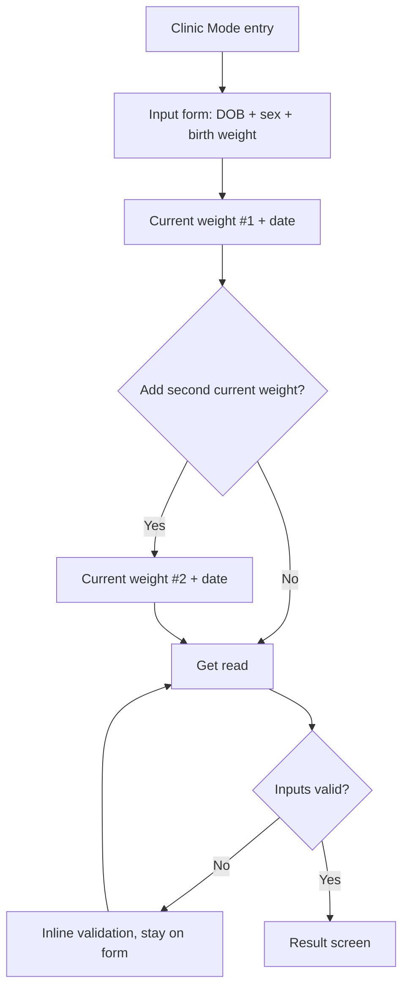
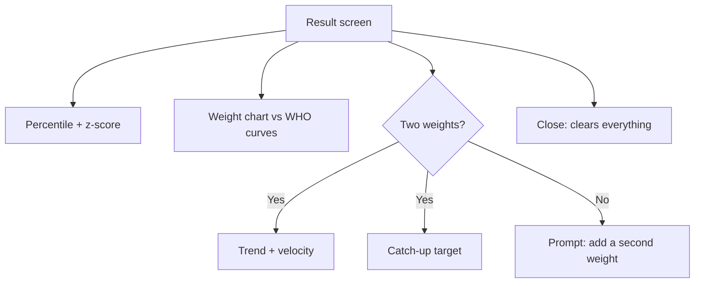

# PRD: Clinic Mode

> **Version:** 1.0
> **Date:** 2026-06-17
> **Status:** Draft
> **Parent product:** growUp (see `docs/PRD.md`)

---

## 1. Problem Statement

At a clinic visit for a baby with failure to thrive (FTT) or a history of IUGR, the clinician has the baby on the scale, the parent across the desk, and only a few minutes. Reading a printed WHO chart by hand is slow and imprecise — it snaps to the nearest printed curve, doesn't give an exact z-score, and leaves no time to explain the result calmly to an anxious parent. The clinician needs an exact, plain-language growth read in seconds, without setting up an account or a patient record they have no time (or mandate) to maintain.

---

## 2. Product Overview

Clinic Mode is a point-of-care surface inside the existing growUp web app. A clinician — pediatrician, nurse, or dietitian — enters the baby's date of birth, sex, birth weight, and one or two current weights, and instantly gets the exact WHO percentile and z-score (LMS method) at birth and now, the weights plotted against the WHO curves, the trend and gain velocity from birth, and the grams/day needed to reach or hold the 3rd-percentile line. Because birth weight anchors the read at day 0, a single current weight already produces a full trend. Nothing is saved: the read lives on screen during the visit and is gone when the screen is closed. No account, no profile, no stored child data — just a fast, accurate, privacy-clean read the clinician can speak straight to the parent.

---

## 3. Target Users

### Primary User
- **Who:** A clinician — pediatrician, well-baby nurse (e.g. Tipat Halav / community clinic), or pediatric dietitian — seeing an infant during a growth-monitoring visit.
- **Technical level:** Medium. Comfortable with web tools, not looking to learn software during a 10-minute appointment.
- **Key pain today:** Reads a printed WHO chart by eye or uses a generic calculator that gives a number with no trend, no projection, and no parent-friendly phrasing. Slow, imprecise, and hard to explain reassuringly.

### Secondary Users
- **The parent in the room:** doesn't operate Clinic Mode but is the audience for the result. The read must be phrased so the clinician can say it out loud without alarming them.

---

## 4. Value Proposition

| We are better than a printed WHO chart because... |
|---|
| Exact percentile and z-score at the baby's *precise* age via LMS — not snapped to the nearest printed curve. |
| Computes trend and gain velocity (g/day) from two points, plus the catch-up target — a printed chart shows none of this. |
| Plain, reassuring phrasing built to be read aloud to a parent, never alarmist. |

| We are better than a generic percentile calculator because... |
|---|
| Purpose-built for the FTT/IUGR conversation: shows the gram gap to the 3rd percentile and the daily gain needed to close it. |
| Plots the points against the full WHO curve set, in context, not just a bare number. |
| No account, no data stored — zero friction and zero patient-data liability for the clinician. |

**Our positioning:** The fastest way to turn one or two weights into an exact, parent-ready growth read at the point of care — with nothing to set up and nothing to store.

---

## 5. User Stories & Flows

**Priority scale:** Must / Should / Could / Won't (MoSCoW)

---

### Epic: Entering Clinic Mode

#### Happy Path
1. Clinician opens growUp and selects **Clinic Mode** from the entry screen.
2. A short, neutral notice confirms: this is a quick read, nothing is saved, not a diagnosis.
3. Clinician taps **Start** and lands on the input form.

> **Edge cases:**
> - Clinician opens Clinic Mode mid-session in the parent app → Clinic Mode is fully independent; no parent data is read or written.
> - Clinician closes/refreshes the tab → everything is cleared; reopening starts blank.

#### Stories

**CLM-1** · Must
As a clinician, I want a clearly labeled Clinic Mode entry point, so that I can switch to point-of-care use without digging through the parent app.
- [ ] Clinic Mode is reachable from the app's main entry screen.
- [ ] Entering Clinic Mode does not read from or write to any parent profile/local data.
- [ ] A brief notice states that nothing is saved and that this supports — not replaces — clinical judgment.

---

### Epic: Capturing Inputs

#### Happy Path
1. Clinician enters **date of birth** and selects **sex** (required for WHO standards).
2. Clinician enters **birth weight** (the baby's weight at birth — anchors the read at day 0).
3. Clinician enters **current weight #1** with its measurement date (defaults to today).
4. Optionally adds **current weight #2** with its date (refines recent velocity).
5. Clinician taps **Get read**.

> **Edge cases:**
> - Birth weight + one current weight is the minimum → percentile/z-score, chart, AND trend/velocity/catch-up all compute (birth is the anchor point).
> - Adding a second current weight refines recent velocity but is never required for a trend.
> - DOB in the future, or any age beyond WHO 0–24mo range → inline, plain-language validation; no result until fixed.
> - A current-weight date before the date of birth, two current weights with the same date, or the second date before the first → inline validation explaining the order needed.
> - Implausible weight (e.g. 50 kg infant, or birth weight far outside viable range) → soft warning asking the clinician to confirm.

#### Flow Diagram

#### UX Notes

| Screen | Empty state | Loading state | Key error state |
|---|---|---|---|
| Input form | Clean form with DOB, sex, birth weight, and one current-weight row visible; clear "+ Add second weight" affordance | Compute is instant; no loading screen needed | "Please enter date of birth, sex, and birth weight so we can compute the WHO percentile." |
| Result screen | N/A (only reached with valid inputs) | Brief inline calc state if needed | "This age is outside the WHO 0–24 month standard — the percentile can't be computed." |

> - Never leave a screen blank — the form opens ready to type, cursor in the first field.
> - Plain-language validation only — no codes, no jargon.
> - Single weight must still produce a useful result; the second weight is additive, never required.

#### Stories

**CLM-2** · Must
As a clinician, I want to enter DOB, sex, birth weight, and one current weight with no account or profile, so that I get a read in seconds.
- [ ] DOB, sex, and birth weight are required; the form explains why (separate WHO standards by sex, exact-age computation, birth weight anchors the trend at day 0).
- [ ] Birth weight plus a single current weight with a date produces a valid percentile and z-score at both birth and now.
- [ ] No name, account, or saved profile is required at any point.

**CLM-3** · Must
As a clinician, I want to optionally add a second current weight, so that I can refine recent gain velocity.
- [ ] A second current weight + date can be added and removed before computing.
- [ ] Trend and g/day velocity are computed from birth onward with one current weight; a second current weight refines recent velocity.
- [ ] Dates are validated for order (on/after birth, second on/after first) and plausibility with plain-language messages.

**CLM-4** · Should
As a clinician, I want soft warnings on implausible inputs, so that a typo doesn't produce a misleading read.
- [ ] Out-of-range age and implausible weight trigger a confirm/soft-warn, not a hard block where a real value is possible.

---

### Epic: Reading the Result

#### Happy Path
1. Clinician sees the **exact percentile and z-score** at the top, in plain language.
2. Below it, the **weight chart** plots the entered point(s) against the 3rd/15th/50th/85th/97th WHO curves.
3. If two weights were entered, a **trend + velocity** line states direction and g/day.
4. A **catch-up target** states the grams/day and weekly gain needed to reach or hold the 3rd-percentile line.
5. Clinician reads the summary aloud to the parent, then closes the screen — nothing is saved.

> **Edge cases:**
> - One weight only → trend, velocity, and catch-up sections show a gentle "add a second weight to see this" rather than empty boxes.
> - Weight at or above a healthy percentile → catch-up framing adapts to "on track / maintaining," never inventing a deficit.
> - Below 3rd percentile → calm, factual framing with the gram gap and a hopeful next number; never alarmist.

#### Flow Diagram

#### UX Notes

| Screen | Empty state | Loading state | Key error state |
|---|---|---|---|
| Result screen | N/A (only valid inputs reach it) | Instant; recompute on edit is in-place | "We couldn't compute a result from these values — please review the inputs." |

> - Phrasing is built to be spoken to a parent: warm, factual, never alarmist.
> - Sections that need the second weight degrade gracefully with a clear prompt, not blank panels.
> - A persistent, quiet reminder that this is informational and supports clinical judgment.

#### Stories

**CLM-5** · Must
As a clinician, I want the exact percentile and z-score for the baby's precise age, so that I have an accurate read to share.
- [ ] Percentile and z-score are computed with the WHO LMS method at the exact age in days, for both birth (day 0) and the latest current weight.
- [ ] Sex-specific WHO standards are applied.
- [ ] The number is paired with one plain-language sentence a clinician can read aloud (e.g. "Born at the Xth percentile, now at the Yth").

**CLM-6** · Must
As a clinician, I want the entered weights plotted against the WHO curves, so that I can show the parent where the baby sits in context.
- [ ] The 3rd/15th/50th/85th/97th percentile curves are drawn for the baby's sex.
- [ ] One or two entered points are plotted accurately on the chart.

**CLM-7** · Must
As a clinician, I want trend and gain velocity from birth, so that I can speak to progress, not just a single snapshot.
- [ ] Direction (gain/loss/flat) and g/day are shown from birth to the latest current weight (always available, since birth weight is a required anchor point).
- [ ] A second current weight refines the recent velocity; the trend never requires more than the birth weight plus one current weight.

**CLM-8** · Must
As a clinician, I want the catch-up target, so that I can give the parent a concrete next number.
- [ ] Grams/day and weekly gain needed to reach or hold the 3rd-percentile line are shown.
- [ ] When the baby is on/above a healthy percentile, framing switches to maintenance, not a fabricated deficit.

**CLM-9** · Must
As a product owner, I want the result phrased non-diagnostically, so that Clinic Mode stays consistent with growUp's "not medical advice" disclaimer.
- [ ] A visible notice states Clinic Mode supports, not replaces, clinical judgment.
- [ ] No copy asserts a diagnosis.

---

### Epic: Privacy & Reset

#### Happy Path
1. Throughout the session, no child data is written to storage or sent to a server.
2. Closing or refreshing the screen clears all entered values.
3. Clinician can start a fresh read in one tap for the next family.

#### Stories

**CLM-10** · Must
As a clinician, I want nothing to be stored, so that I carry no patient-data liability between visits.
- [ ] No entered value is persisted to local storage, server, or analytics in identifiable form.
- [ ] Closing/refreshing the screen clears all inputs and results.

**CLM-11** · Must
As a clinician, I want a one-tap reset, so that I can serve the next family without leftover data.
- [ ] A clear "New read" action returns to a blank form with nothing pre-filled.

---

### V1.1 Stories (post-launch, no full AC needed)

#### Epic: Hand-off
- **CLM-12** · Could — As a parent, I want to receive the read from the visit (e.g. QR/link to import into my own growUp), so that I can keep tracking at home. *(Deferred: MVP is screen-only by decision.)*
- **CLM-13** · Could — As a clinician, I want an on-the-spot printable one-pager (no data stored), so that the family leaves with the read. *(Deferred: MVP is screen-only by decision.)*

#### Epic: Efficiency
- **CLM-14** · Should — As a clinician, I want to enter more than two weights, so that I can read longer trends during a follow-up visit.

---

## 6. Screen Inventory

**Navigation pattern:** Stack (linear: entry → form → result), reachable from the app's main entry screen.

| Screen | Epic | Purpose | Entry points |
|---|---|---|---|
| Clinic Mode entry / notice | Entering Clinic Mode | Explain the mode (quick, nothing saved, not a diagnosis) and start | App main entry screen |
| Input form | Capturing Inputs | Enter DOB, sex, birth weight, and one or two current weights with dates | From Clinic Mode entry; from "New read" on result |
| Result screen | Reading the Result | Show percentile/z-score, chart, trend/velocity, catch-up target | After valid inputs on the form |
| Inline validation states | Capturing Inputs | Plain-language correction for invalid DOB/age/weight/date order | Within the input form |

---

## 7. Scope

### In Scope (MVP)
- Clinic Mode entry inside the existing growUp web app.
- Inputs: DOB, sex, birth weight, and one or two current weights with dates. No account, no profile.
- Outputs: exact WHO percentile + z-score at birth and now, chart vs WHO curves (birth point + current point(s)), trend + g/day velocity from birth, catch-up target to the 3rd percentile.
- Fully ephemeral: nothing stored, screen-only, one-tap reset.
- Non-diagnostic, parent-readable phrasing and disclaimer.

### Out of Scope (explicitly excluded)
- **Print/PDF or QR hand-off** — decided screen-only for MVP; revisit in V1.1 if parents need to keep the read.
- **Saved patient lists / repeat-visit history** — conflicts with the ephemeral, no-data-stored decision; would add privacy/compliance burden.
- **Clinician accounts / login** — not needed for MVP; matches growUp's no-account ethos.
- **EHR / clinic-system integration** — heavy and compliance-laden; far post-MVP.
- **Metrics other than weight** (height, head circumference, BMI) — weight is the focus; defer.
- **More than two weights** — V1.1 (CLM-14).

---

## 8. Success Metrics

| Metric | Baseline | Target at launch | Target at 90 days |
|---|---|---|---|
| Time-to-insight (open Clinic Mode → complete read) | n/a | < 90s median | < 60s median |
| Reads completed per active week (anonymous count) | 0 | Measurable trend | Steady week-over-week growth |
| Single-weight reads that add a second weight | n/a | — | Track as an engagement signal |
| Validation-error rate per completed read | n/a | < 1 error/read | Decreasing |

**Success definition:** A clinician can go from opening Clinic Mode to a complete, parent-ready growth read in under a minute, with no setup and nothing stored.

---

## 9. Competitive Analysis

| Competitor | Strengths | Weaknesses | Pricing |
|---|---|---|---|
| Printed WHO growth charts | Universal, trusted, zero tech | Manual, imprecise (snaps to nearest curve), no z-score/trend/projection, no parent-ready phrasing | Free |
| Generic online percentile calculators | Quick single number | No trend/velocity, no catch-up target, no FTT/IUGR framing, often store data / show ads | Free–freemium |
| EHR built-in growth charts | Integrated with records | Slow, clinic-bound, not designed for a calm parent conversation, requires login | Part of EHR contract |

**Our opening:** an exact, trend-aware, parent-readable read that needs no login and stores nothing — faster than a printed chart and richer than a generic calculator.

---

## 10. Constraints & Limitations

### Business Constraints
- Must preserve growUp's privacy-first, no-account, local-first positioning (Clinic Mode stores nothing).
- Must stay consistent with the "not medical advice" disclaimer; Clinic Mode supports clinical judgment, it does not diagnose.
- Reuses the existing WHO LMS engine and charting — no new medical-data source.

### Known Unknowns
- **Risk:** Screen-only (no hand-off) may frustrate parents who want to keep the read — may pull CLM-12/13 forward.
- **Risk:** "One or two weights" still requires DOB + sex; clinicians must perceive the form as fast enough to beat a printed chart.
- **Risk:** With no accounts and nothing stored, success measurement relies entirely on anonymous, non-identifying analytics.

---

## 11. Open Questions

**Blocks development (must answer before building):**
- [ ] Where exactly does the Clinic Mode entry point sit on the main screen, and does switching modes need an explicit "exit" back to the parent app?
- [ ] What anonymous analytics (if any) are acceptable given the no-data-stored stance, so we can measure time-to-insight and read counts?

**Decide during development (can be deferred):**
- [ ] Exact plausibility thresholds for the soft weight/age warnings.
- [ ] Default chart zoom for one vs two points (reuse the parent app's focus ranges?).
- [ ] Final wording of the non-diagnostic notice for the clinician audience.

---

## Next Steps

This PRD is ready. To continue:
1. **`/create-hld`** — technical design (how Clinic Mode reuses the WHO engine, routing, ephemeral state handling)
2. **`/create-ui`** — design system additions + screen blueprints + component shells for the three Clinic Mode screens
3. **`/plan-for-agents`** — wave-based parallel agent execution plan
4. **`/tests-for-agents`** — QA test plan (TEST.md + qa-plan.json)

*This PRD is a living document. Update it as decisions are made.*
