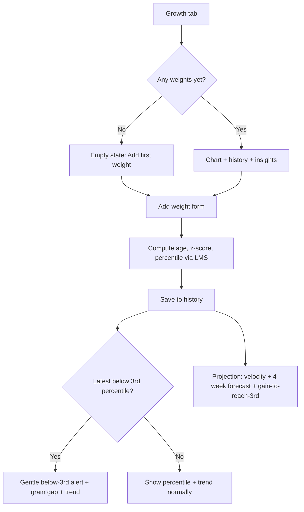

# PRD: GrowUp

> **Version:** 1.0
> **Date:** 2026-06-09
> **Status:** Draft

---

## 1. Problem Statement

Parents of infants diagnosed with failure to thrive (FTT) or with a history of intrauterine growth restriction (IUGR) live with constant, low-grade anxiety about whether their baby is growing enough. Between pediatric visits — often weeks apart — they have no easy way to see if today's weight is "on track," how it compares to the WHO standard for their baby's exact age, or whether the recent trend is improving. They are handed numbers and percentiles they don't fully understand, and the gap between visits is where the worry lives. Today they rely on memory, scraps of paper, a generic baby app, or anxious googling — none of which speak to their specific clinical situation in a calm, clear way.

---

## 2. Product Overview

GrowUp is a warm, calm, phone-friendly web app that helps parents of FTT/IUGR infants track their baby's weight and plan feeding between doctor visits. It plots the baby's weight against the official WHO Child Growth Standards, computes the exact percentile and z-score for the baby's precise age, and — when things are below the healthy line — explains in plain, reassuring language how far below they are and what recent progress looks like. It also includes a feeding calculator that turns the baby's weight into a daily milk-volume target, including support for high-calorie special formulas. GrowUp is a private tracking and information companion — never a replacement for the pediatrician or dietitian — designed to replace anxiety with understanding.

---

## 3. Target Users

### Primary User
- **Who:** A parent (typically a mother in the first 0–24 months) of an infant diagnosed with FTT, or born with IUGR / small-for-gestational-age, who has been told to "watch the weight."
- **Technical level:** Low to medium. Comfortable with a phone and apps, not with clinical math or growth charts.
- **Key pain today:** Tracks weights on paper or in their head; can't tell what a number means for their baby's exact age; feels anxious and powerless between visits; doesn't know how much to feed or whether a concentrated/special formula changes the amount.
- **Emotional state:** Stressed and worried. Every word of copy must be warm, calm, and reassuring.

### Secondary Users
- **Co-parent / family member** who helps with feeding and wants to see the same numbers.
- *(Not a separate account — they simply use the same device/browser. No multi-user support in MVP.)*

---

## 4. Value Proposition

| We are better than the alternatives because... |
|---|
| **vs. doing nothing / paper:** We compute the exact WHO percentile and z-score for the baby's precise age using the official LMS method — not a guess from eyeballing a printed curve. |
| **vs. a generic baby-tracking app:** We speak directly to the FTT/IUGR situation — gentle below-3rd-percentile alerts, transparent weight-gain projections, and "what gain is needed to reach the 3rd percentile." |
| **vs. a sterile medical tool:** Every screen is warm, calm, and reassuring — built for a stressed parent, not a clinician. |
| **vs. a feeding rule of thumb:** Our feeding calculator adjusts the milk volume for high-calorie/special formulas so the baby still hits the same calorie target. |

**Our positioning:** GrowUp wins by turning intimidating clinical data into calm, transparent, parent-readable insight — private, free, and always in your pocket — while being explicit that it informs, and never replaces, professional care.

---

## 5. User Stories & Flows

Stories are grouped by epic. Priority scale: **Must / Should / Could / Won't** (MoSCoW).

---

### Epic: Child Profile

#### Happy Path
1. On first open, the parent sees a warm welcome with a short medical disclaimer and a "Add your baby" call to action.
2. They enter the baby's **name**, **sex** (male / female — required for the correct WHO standard), and **date of birth**.
3. They save. The app now shows the baby's name and current age (in completed weeks and months, computed from DOB).
4. They can return any time to **edit** the profile if a detail was wrong.

> **Edge cases:**
> - No child yet → every other tab shows a friendly empty state pointing back to "Add your baby."
> - Future date of birth entered → gentle inline validation, save blocked.
> - Sex not selected → save blocked with a calm explanation of why it's needed (WHO standards differ by sex).

#### UX Notes

| Screen | Empty state | Loading state | Key error state |
|---|---|---|---|
| Profile | "Let's start with your baby" + Add button | Instant (local data) | Invalid DOB / missing sex → friendly inline message |

> - Explain *why* sex is required (WHO boys/girls standards differ) so it doesn't feel intrusive.
> - Age is always shown in plain terms ("3 months, 1 week"), never raw days only.

#### Stories

**PROF-1** · Must
As a parent, I want to add my baby with name, sex, and date of birth, so that the app can compute the correct WHO percentiles for them.
- [ ] Name, sex (male/female), and DOB are all captured
- [ ] DOB cannot be in the future
- [ ] Sex and DOB are required; the app explains why sex is needed
- [ ] After saving, the baby's current age shows in completed weeks and months

**PROF-2** · Must
As a parent, I want to edit my baby's profile, so that I can fix a mistake in the name, sex, or DOB.
- [ ] All fields are editable
- [ ] Editing DOB or sex recomputes all derived ages and percentiles
- [ ] Changes persist across browser sessions

**PROF-3** · Must
As a parent, I want the app to remember my baby without any login, so that my data is private and instantly available.
- [ ] Profile is stored locally on the device, no account required
- [ ] Data survives closing and reopening the browser

---

### Epic: WHO Weight Tracking

#### Happy Path
1. The parent opens the **Growth** tab and taps "Add weight."
2. They enter a **weight** and the **date** it was taken (defaults to today).
3. The app computes the baby's exact age for that date and the **percentile** and **z-score** using the WHO LMS method.
4. The new point appears on a **chart** plotted against the WHO percentile curves (3rd, 15th, 50th, 85th, 97th).
5. Below the chart, a **history list** shows every entry with its computed percentile and z-score; entries can be **edited or deleted**.
6. If the latest weight is **below the 3rd percentile**, a gentle alert explains the current percentile, the gram gap to reach the 3rd-percentile line, and the recent trend.
7. A **projection** uses the last few measurements to estimate weight-gain velocity (g/day), projects ~4 weeks ahead against the WHO curves, and shows what daily/weekly gain would be needed to reach the 3rd percentile.

> **Edge cases:**
> - Weight entered for a date before DOB or beyond the supported age range (0–24 months) → blocked with a calm message.
> - Only one measurement → percentile/z-score still shown; projection explains it needs at least two points.
> - Weight lower than a previous entry → shown plainly and flagged as an insight, never alarmingly.

#### Flow Diagram

#### UX Notes

| Screen | Empty state | Loading state | Key error state |
|---|---|---|---|
| Growth (chart) | "Add your baby's first weight to see the chart" | Instant (local + local LMS data) | Date out of 0–24mo range → calm inline message |
| Add/Edit weight | n/a (form) | Instant | Invalid weight or date → inline validation |
| Insights | "Add a couple of weights to unlock insights" | Instant | — |

> - Below-3rd alerts are **clear but never frightening** — they always pair the concern with a concrete, hopeful next number ("X grams to reach the 3rd-percentile line").
> - All math is shown transparently (velocity in g/day, the projection assumptions) so a parent — or their doctor — can follow it.
> - Insight cards are an explicit **extension point**: starter cards (weight loss between visits, slow velocity, percentile drop across 2+ measurements) plus a clearly-marked TODO area for adding more.

#### Stories

**WHO-1** · Must
As a parent, I want to record my baby's weight with the date, so that I can build a history over time.
- [ ] Weight and date captured; date defaults to today
- [ ] Date must be within the baby's supported age range (0–24 months) and not before DOB
- [ ] Entries are listed in a history I can scroll
- [ ] I can edit or delete any entry

**WHO-2** · Must
As a parent, I want each weight to show its WHO percentile and z-score, so that I understand where my baby stands for their exact age.
- [ ] Percentile and z-score computed with the WHO LMS method (not snapped to the nearest curve)
- [ ] Uses the correct table for the baby's sex
- [ ] Values shown per entry and for the latest weight prominently

**WHO-3** · Must
As a parent, I want to see my baby's weights plotted against the WHO percentile curves, so that I can visually see the trend.
- [ ] Chart shows 3rd, 15th, 50th, 85th, 97th percentile curves for 0–24 months
- [ ] The baby's measured points are overlaid on the curves
- [ ] Chart is readable on a phone screen

**WHO-4** · Must
As a worried parent, I want a gentle, clear alert when the latest weight is below the 3rd percentile, so that I understand the situation without panic.
- [ ] Alert appears only when the latest weight is below the 3rd percentile
- [ ] States the current percentile in plain language
- [ ] States the gram difference needed to reach the 3rd-percentile weight at the current age
- [ ] Describes the recent trend (improving / steady / declining)
- [ ] Tone is warm and reassuring, paired with a next step (talk to your care team)

**WHO-5** · Must
As a parent, I want a transparent projection of where my baby is heading, so that I can see if the current trend reaches a healthy line.
- [ ] Computes recent weight-gain velocity (g/day) from the last few measurements
- [ ] Projects ~4 weeks ahead against the WHO curves
- [ ] States the daily and weekly gain needed to reach the 3rd percentile
- [ ] Explains its own assumptions in plain language
- [ ] Gracefully explains when there aren't enough measurements yet

**WHO-6** · Should
As a parent, I want smart insight cards, so that important changes are surfaced without me hunting for them.
- [ ] Starter cards: weight loss between visits, slow velocity, percentile drop across 2+ measurements
- [ ] Cards use warm, plain language
- [ ] A clearly-marked extension point exists in the code for adding more insights

**WHO-7** · Should
As a parent, I want to view my baby's weight-for-age z-score over time, so that I can see whether their growth trajectory is improving, holding steady, or declining — independent of absolute weight gain (an FTT/IUGR baby can gain weight while still losing ground relative to the WHO standard).
- [ ] The Growth screen offers a `Weight | Z-score` chart toggle when weight entries exist (default: Weight)
- [ ] The Z-score view plots every measurement exactly once at its exact age (no snapping to a curve grid, no dropping close-together points)
- [ ] Z-scores use the correct sex-specific WHO LMS table and exact age in days
- [ ] Subtle, labelled reference lines at z = 0 (median), −2, and −3; calm tokens, never red
- [ ] Y-axis scaling keeps the 0/−2/−3 anchors visible and avoids making small changes look dramatic
- [ ] Single entry → one dot; 2+ entries → a connected trajectory line; accessible fallback table lists date, age, weight, z-score (2 dp), and percentile for every entry

**WHO-8** · Should
As a parent already tracking in another app, I want to import my baby's weights from a Nara Baby CSV export, so that I don't have to re-enter months of history by hand.
- [ ] An "Import from Nara Baby" action on the Growth screen accepts the app's CSV export and extracts weight entries (weights only for now)
- [ ] Before importing, a preview shows how many weights are new, how many will update an existing date, and how many fall outside the supported 0–24 month range
- [ ] Imported weights go into the current child; an existing entry on the same date is overwritten with the CSV value; out-of-range dates are skipped
- [ ] A non–Nara-Baby file is rejected with a calm, plain-language message
- [ ] The import never alters the child's profile

**WHO-9** · Should
As a parent, I want the weight chart to focus on my baby's recent data so that small but important week-to-week changes are easy to see, instead of being squashed into the full 0–24 month range.
- [ ] The weight chart defaults to a focused window around the baby's data (not the empty full range), with the Y-axis fit to the visible data so small changes are legible
- [ ] A time-range control (`1mo · 3mo · 6mo · All`) lets the parent widen or narrow the visible age window
- [ ] Nearby WHO percentile lines remain visible for context within the focused view
- [ ] Works on a phone with no gestures required; the accessible fallback table is unaffected

---

### Epic: Feeding Calculator

#### Happy Path
1. The parent opens the **Feeding** tab.
2. They enter the baby's **weight** (or it's prefilled from the latest weight entry).
3. The app shows the **daily milk-volume range** using the standard 120–200 ml/kg/day rule, and a **suggested per-feed amount** based on the number of feeds per day (default 8, adjustable).
4. They can switch on **high-calorie / special formula mode** and enter their formula's energy (kcal/ml or kcal/oz).
5. The app recomputes the volume range so the baby still receives the same calories — a more concentrated formula yields a **lower** ml range — and shows both the calorie target and the adjusted volume range.

> **Edge cases:**
> - No weight available → friendly prompt to enter one or add a weight in Growth.
> - kcal value left at the standard (~0.67 kcal/ml) → high-cal mode produces the same range as standard, explained plainly.
> - Feeds-per-day set to 0 → blocked with a gentle message.

#### UX Notes

| Screen | Empty state | Loading state | Key error state |
|---|---|---|---|
| Feeding | "Enter a weight to see feeding amounts" | Instant | Invalid weight / 0 feeds → inline validation |

> - Show the **multipliers and math transparently** (120–200 ml/kg, kcal/ml conversion) so it's trustworthy and editable.
> - The 120 / 200 multipliers and the standard 0.67 kcal/ml are configurable constants, surfaced clearly.

#### Stories

**FEED-1** · Must
As a parent, I want to enter my baby's weight and see the recommended daily milk range, so that I know roughly how much to offer.
- [ ] Daily range computed as 120–200 ml/kg/day (multipliers are named constants)
- [ ] Weight can be entered manually or prefilled from the latest weight entry
- [ ] A suggested per-feed amount is shown based on feeds/day

**FEED-2** · Must
As a parent, I want to set the number of feeds per day, so that the per-feed amount matches my baby's routine.
- [ ] Feeds/day defaults to 8 and is adjustable
- [ ] Per-feed amount updates from the daily range and feeds/day
- [ ] Zero or invalid feed counts are blocked gently

**FEED-3** · Must
As a parent using a special formula, I want to enter its calorie density, so that the volume is adjusted to deliver the right calories.
- [ ] High-calorie mode accepts kcal/ml or kcal/oz
- [ ] Standard density (~0.67 kcal/ml / 20 kcal/oz) is the reference
- [ ] Adjusted volume range delivers the same calories as the standard range
- [ ] Both the calorie target and the adjusted volume range are shown
- [ ] A more concentrated formula correctly produces a lower volume range

**FEED-4** · Should
As a parent, I want to enter my baby's average daily intake (ml/day over the last 7 days) and see it on a scale against how much they need, so that I can tell at a glance whether they're eating enough.
- [ ] A single "average daily intake (last 7 days)" value can be entered (ml/day) and persists per child
- [ ] A gauge shows the recommended need band (120–200 ml/kg/day, from the current weight) and the intake as a marker line on the same ml/day scale
- [ ] A plain-language readout states the intake, the recommended range, and whether intake is within / below / above it (below uses calm caution styling, never red; status not by color alone)
- [ ] Shown only when a valid weight is present

---

### Epic: App Shell & Trust (cross-cutting)

#### Stories

**APP-1** · Must
As a parent, I want a simple bottom navigation between Growth, Feeding, and Profile, so that I can move around easily on my phone.
- [ ] Three tabs: Growth, Feeding, Profile
- [ ] Works one-handed on a phone; meets minimum touch-target size

**APP-2** · Must
As a parent, I want my data to persist privately on my device, so that nothing is lost and no account is needed.
- [ ] All data stored locally (no backend, no login)
- [ ] Data survives reload and browser restart
- [ ] Empty states are handled warmly on every screen

**APP-3** · Must
As a parent, I want a clear, always-visible medical disclaimer, so that I understand this app informs but does not replace professional care.
- [ ] Non-dismissable disclaimer shown in onboarding and persistently (footer)
- [ ] States the app is for tracking/information only, is not medical advice, and that FTT/IUGR require professional care
- [ ] Written in warm, plain language

**APP-4** · Should
As a parent, I want the app to remember where I was when I switch between tabs, so that I don't lose my place or have to re-pick the chart view every time.
- [ ] Scroll position is restored per tab when returning to it
- [ ] The Growth chart's view (Weight / Z-score) and time range persist across tab switches and survive a reload
- [ ] Persisted UI state never affects the baby's data; it's view-only preferences

---

### V1.1 Stories (post-launch, deferred from MVP)

#### Epic: More Growth Measures
- **GROW-7** · Should — As a parent, I want to track length-for-age and head-circumference-for-age against WHO standards, so that I see the full growth picture my care team watches.

#### Epic: Multiple Children
- **MULTI-1** · Should — As a parent of twins or siblings, I want to add and switch between multiple children, so that I can track each one.

#### Epic: Data Safety
- **EXPORT-1** · Should — As a parent, I want to export and re-import all my data (JSON/CSV), so that I don't lose everything if my browser data is cleared.

#### Epic: Feeding Log
- **FLOG-1** · Could — As a parent, I want to log actual feeds (time + amount) and compare the daily total to the target, so that I can track real intake, not just the recommendation.

#### Other deferred ideas
- **SHARE-1** · Could — Generate a simple shareable summary/report for the pediatrician or dietitian.
- **NOTE-1** · Could — Attach notes to a weight entry (e.g. "after a cold", "post-visit").

---

## 6. Screen Inventory

**Navigation pattern:** Bottom tabs (mobile-first), three tabs.

| Screen | Epic | Purpose | Entry points |
|---|---|---|---|
| Onboarding / Welcome | App Shell & Trust | First-run welcome, disclaimer, and prompt to add the first baby | App open with no profile |
| Add / Edit Child | Child Profile | Capture or edit name, sex, DOB | Onboarding; Profile tab |
| Profile | Child Profile | Show baby's name, age, and edit access; persistent disclaimer in footer | Profile tab |
| Growth | WHO Weight Tracking | Chart of weights vs. WHO curves, history list, insights, alerts, projection | Growth tab |
| Add / Edit Weight | WHO Weight Tracking | Capture or edit a weight + date | Growth tab (Add / tap an entry) |
| Feeding | Feeding Calculator | Compute daily/per-feed volume, high-calorie mode | Feeding tab |

---

## 7. Scope

### In Scope (MVP)
- Single child profile: add/edit name, sex, DOB; compute age in completed weeks/months.
- WHO weight-for-age tracking (0–24 months, boys & girls) using the LMS method for exact percentile & z-score.
- Weight history with edit/delete; chart vs. 3rd/15th/50th/85th/97th percentile curves.
- Gentle below-3rd-percentile alert (current percentile, gram gap, trend).
- Transparent weight-gain projection (velocity, ~4-week forecast, gain-to-reach-3rd).
- Starter insight cards + clearly-marked extension point for more.
- Feeding calculator: 120–200 ml/kg/day range, per-feed amount (configurable feeds/day, default 8).
- High-calorie / special formula mode (kcal/ml or kcal/oz) with calorie-matched volume.
- Bottom-tab navigation (Growth, Feeding, Profile), local-only persistence, warm empty states.
- Non-dismissable medical disclaimer (onboarding + footer).

### Out of Scope (explicitly excluded from MVP)
- **Length & head-circumference tracking** — roughly doubles the WHO data and chart work; defer to V1.1 once weight tracking is validated.
- **Multiple children** — keeps the MVP data model and UI simple; the core value is provable with one child.
- **Data export / backup** — valuable safety net, but not required to deliver the core insight; defer to V1.1.
- **Feeding log + reminders** — a separate tracking surface beyond the calculator; meaningful scope, defer to V1.1.
- **Accounts, cloud sync, multi-device** — deliberately local-only and login-free for the MVP.
- **Sharing/report export, per-entry notes** — nice-to-haves, deferred.

---

## 8. Success Metrics

This is a private, local-only personal tool with no backend, so traditional product analytics (DAU/MRR) do not apply and are not collected. Success is qualitative and usage-shaped:

| Signal | What "working" looks like |
|---|---|
| Reassurance | A parent can open the app and, within seconds, understand where their baby stands and whether the trend is improving — replacing anxiety with clarity. |
| Repeat use | A parent records weights regularly between visits because the chart and insights feel worth updating. |
| Comprehension | A parent (or their doctor) can follow exactly how a percentile, gram gap, and projection were calculated. |
| Trust & safety | The medical disclaimer is always understood; the app never feels like it's replacing the care team. |

**Success definition:** At launch, a parent of an FTT/IUGR infant can log a weight, instantly see an accurate WHO percentile and a calm, transparent read on the trend, and get a feeding amount they can act on — all on their phone, privately, without an account.

---

## 9. Competitive Analysis

| Competitor | Strengths | Weaknesses (our opening) | Pricing |
|---|---|---|---|
| Generic baby trackers (e.g. mainstream baby apps) | Broad feature sets, polished | Generic percentiles, not FTT/IUGR-aware, no transparent projection or below-3rd guidance, often sterile/clinical tone | Free / freemium |
| Printed WHO growth charts (paper) | Authoritative, free | Manual, error-prone eyeballing, no exact z-score, no projection, no feeding help | Free |
| Clinical / EMR growth tools | Accurate, used by clinicians | Not parent-facing, no reassurance, inaccessible between visits | N/A to parents |

---

## 10. Constraints & Limitations

### Business Constraints
- **Privacy:** All data stays on the parent's device; no account, no server collection of health data.
- **Safety / liability:** Must clearly and persistently state it is not medical advice; FTT/IUGR require professional care.
- **Tone:** Copy must remain warm, calm, and reassuring for a stressed audience — a hard product requirement, not a nice-to-have.

### Known Unknowns
- **WHO data source & units:** Exact LMS tables to embed (weight-for-age, 0–24 months, by sex) and units shown to parents (kg vs g) — to be locked in the HLD.
- **Projection method details:** How many recent measurements feed the velocity calculation, and how to communicate uncertainty honestly.
- **Localization / RTL:** Whether the MVP ships in additional languages (e.g. Hebrew/RTL) or English-first — affects copy and layout.

---

## 11. Open Questions

**Blocks development (must answer before building):**
- [ ] Which exact WHO weight-for-age LMS tables (source, granularity, age range) do we embed, and in what units do we display weight to parents? *(Most important — it underpins every calculation in the core feature.)*
- [ ] What is the MVP UI language — English-only, or English + Hebrew/RTL? *(Affects all copy and layout from day one.)*

**Decide during development (can be deferred):**
- [ ] How many recent measurements should the velocity/projection use by default (e.g. last 2–3 vs. a time window)?
- [ ] Exact wording of the below-3rd alert and disclaimer, reviewed for tone.
- [ ] Default kcal density value and whether to prefill feeding weight from the latest measurement automatically.

---

## Next Steps

This PRD is ready. To continue:
1. **`/create-hld`** — generate the High Level Design (tech stack, data model, WHO LMS data handling, component tree, folder structure)
2. **`/create-ui`** — design system + screen blueprints + component shells
3. **`/plan-for-agents`** — turn PRD + HLD + UI shells into a wave-based parallel agent execution plan
4. **`/tests-for-agents`** — generate the QA test plan (TEST.md + qa-plan.json)

*This PRD is a living document. Update it as decisions are made.*
